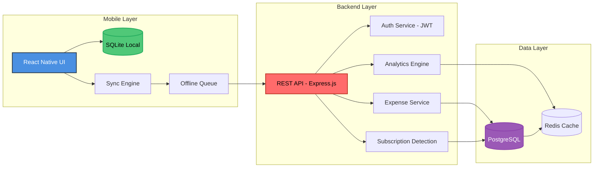
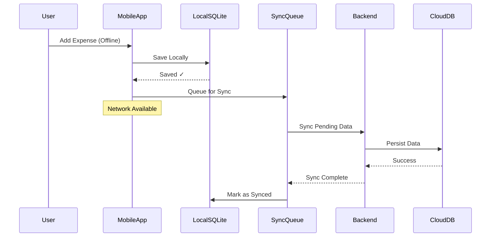
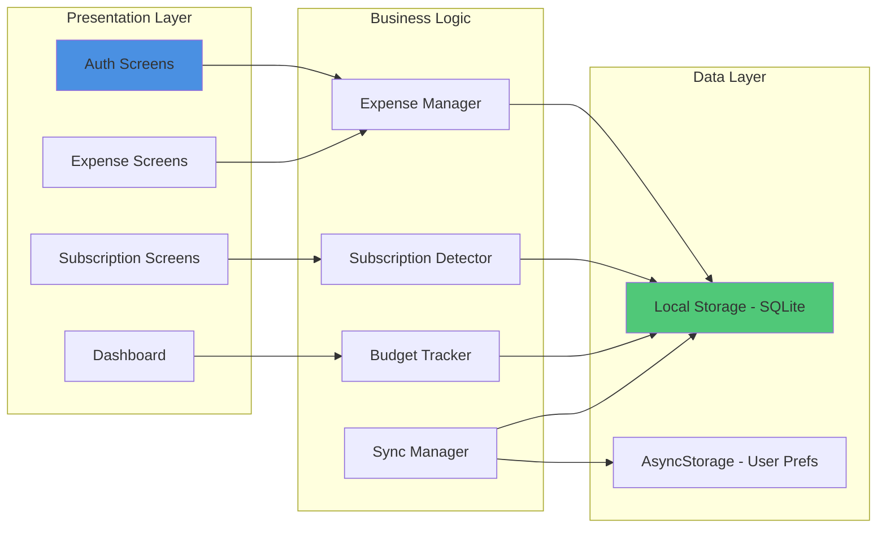
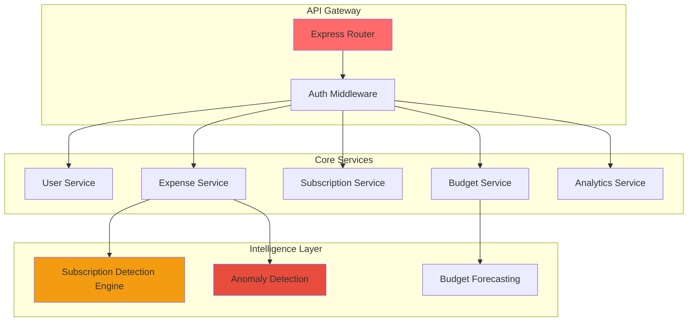
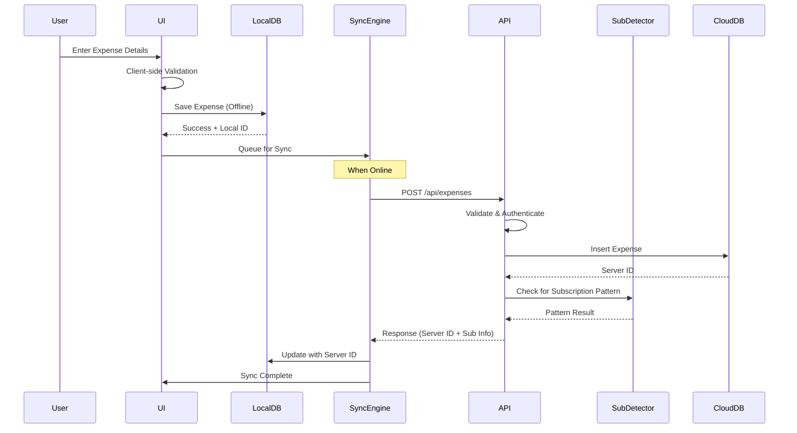
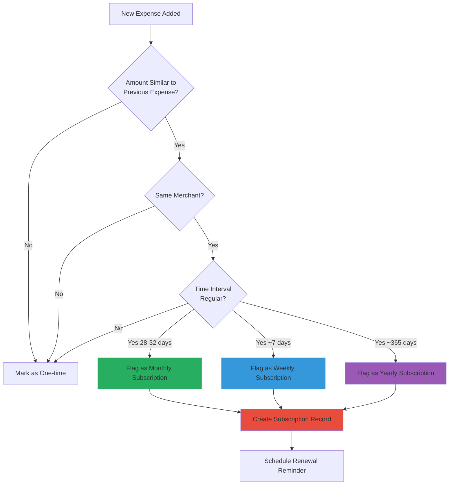
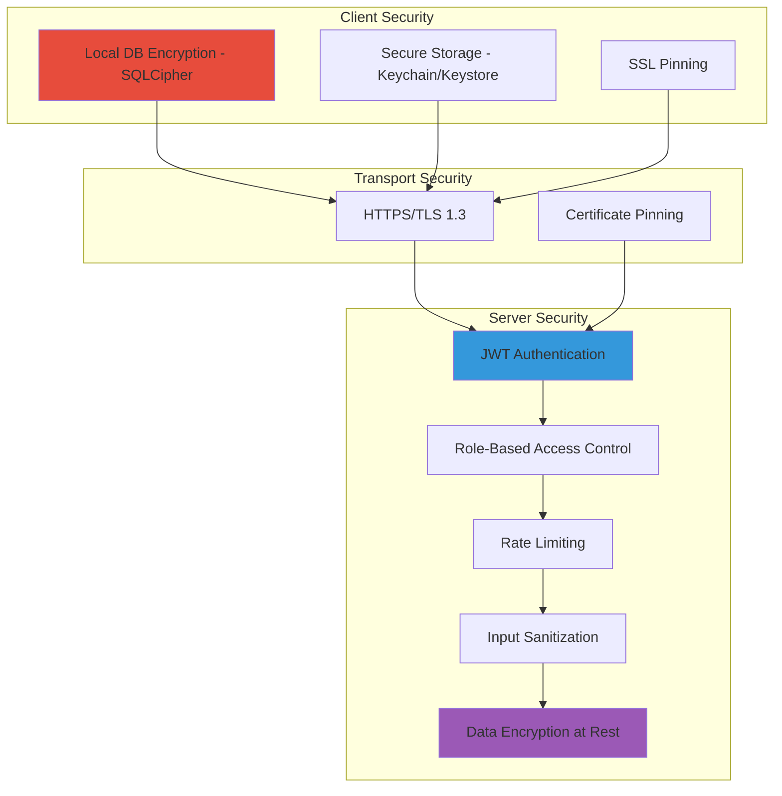
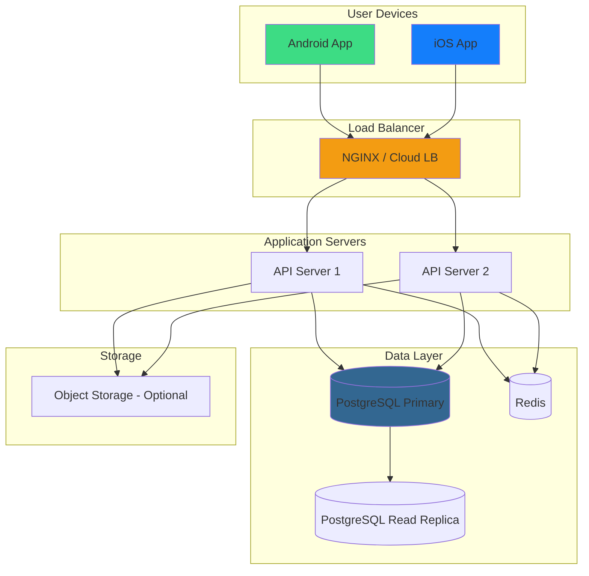
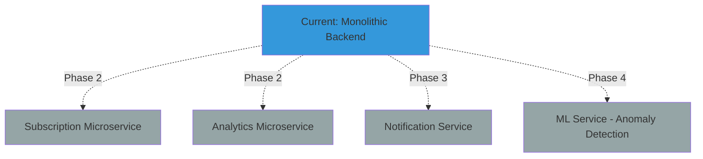

# SyncSpend - System Architecture Documentation

## 1. Overview

SyncSpend is a **privacy-first, offline-capable expense tracking and subscription intelligence mobile application**. The system is designed as a **three-tier architecture** with:

1. **Mobile Application Layer** (React Native)
2. **Backend API Layer** (Node.js + Express)
3. **Data Persistence Layer** (SQLite local + PostgreSQL cloud)

## 2. High-Level Architecture Diagram

## 3. Offline-First Architecture

## 4. Component Architecture

### 4.1 Mobile Application Components

### 4.2 Backend Services Components

## 5. Data Flow Diagrams

### 5.1 Expense Creation Flow

### 5.2 Subscription Detection Flow

## 6. Security Architecture

## 7. Deployment Architecture

## 8. Technology Stack Overview

| Layer | Technology | Purpose |
|-------|-----------|---------|
| **Mobile Frontend** | React Native | Cross-platform mobile development |
| **Local Database** | SQLite + SQLCipher | Offline storage with encryption |
| **Backend API** | Node.js + Express | RESTful API server |
| **Cloud Database** | PostgreSQL | Primary data persistence |
| **Caching** | Redis | Session & query caching |
| **Authentication** | JWT + bcrypt | Secure auth with password hashing |
| **Hosting** | Render / Railway / AWS | Cloud deployment |

## 9. Key Architectural Decisions

### 9.1 Offline-First Design
**Decision**: All data operations work offline by default  
**Rationale**: Users need to track expenses even without internet connectivity  
**Implementation**: Local SQLite database with background sync queue

### 9.2 Privacy-First Approach
**Decision**: Data minimization and local-first processing  
**Rationale**: Build user trust and comply with privacy expectations  
**Implementation**: 
- All sensitive analytics run locally
- Cloud sync is optional
- No third-party analytics SDKs

### 9.3 Hybrid Intelligence
**Decision**: Simple rule-based detection, not ML  
**Rationale**: 
- ML requires large datasets (privacy conflict)
- Rule-based is explainable and transparent
- Sufficient for MVP phase

**Implementation**:
- Pattern matching for subscriptions
- Threshold-based anomaly detection
- Time-series analysis for budgets

## 10. Performance Targets

| Metric | Target | Measurement |
|--------|--------|-------------|
| App Launch Time | < 2s | Time to interactive |
| Expense Entry | < 500ms | Save to local DB |
| Sync Time | < 5s | For 100 expenses |
| API Response Time | < 200ms | P95 latency |
| Offline Capability | 100% | All core features |
| Database Size | < 50MB | For 1 year data |

## 11. Scalability Considerations

- **Horizontal Scaling**: Stateless API servers behind load balancer
- **Database**: Read replicas for analytics queries
- **Caching**: Redis for frequently accessed data
- **CDN**: Static assets served via CDN (future)
- **Microservices**: Monolith for MVP, modular for future split

## 12. Future Architecture Extensions

---

**Document Version**: 1.0  
**Last Updated**: February 12, 2026  
**Authors**: Aarya Patil, Prathmesh Bhardwaj  
**Project**: SyncSpend - Privacy-First Expense Intelligence
