# SyncSpend - Module-Wise Design Document

## Table of Contents
1. [Module Overview](#module-overview)
2. [Backend Modules](#backend-modules)
3. [Mobile Application Modules](#mobile-application-modules)
4. [Shared/Common Modules](#sharedcommon-modules)
5. [Module Interaction Patterns](#module-interaction-patterns)

---

## 1. Module Overview

SyncSpend is organized into **8 primary modules** across backend and mobile platforms:

### Backend Modules (5)
1. **Authentication Module** - User registration, login, JWT management
2. **Expense Management Module** - CRUD operations for expenses
3. **Subscription Intelligence Module** - Detection and tracking
4. **Budget Management Module** - Budget creation and monitoring
5. **Analytics Module** - Data aggregation and insights

### Mobile Modules (3)
1. **UI Components Module** - Reusable React Native components
2. **Data Persistence Module** - Local storage and sync
3. **Business Logic Module** - Client-side intelligence

---

## 2. Backend Modules

### 2.1 Authentication Module

#### Responsibilities
- User registration with email/password
- Secure password hashing (bcrypt)
- JWT token generation and validation
- Session management
- Password reset functionality

#### Components

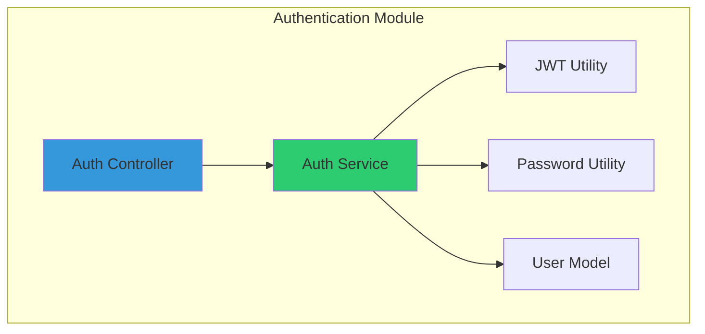

#### API Endpoints

| Method | Endpoint | Description | Auth Required |
|--------|----------|-------------|---------------|
| POST | `/api/auth/register` | Create new user account | No |
| POST | `/api/auth/login` | Authenticate user | No |
| POST | `/api/auth/refresh` | Refresh JWT token | Yes |
| POST | `/api/auth/logout` | Invalidate session | Yes |
| POST | `/api/auth/forgot-password` | Request password reset | No |

#### Data Models

```javascript
// User Model
{
  id: UUID,
  email: String (unique),
  passwordHash: String,
  name: String,
  createdAt: Timestamp,
  updatedAt: Timestamp,
  isActive: Boolean
}

// JWT Payload
{
  userId: UUID,
  email: String,
  iat: Timestamp,
  exp: Timestamp
}
```

#### Security Measures
- Passwords hashed with bcrypt (10 rounds)
- JWT tokens expire after 7 days
- Refresh tokens stored securely
- Rate limiting on auth endpoints (5 attempts/15 min)
- Input validation and sanitization

---

### 2.2 Expense Management Module

#### Responsibilities
- Create, read, update, delete expenses
- Categorize expenses
- Attach metadata (merchant, notes, tags)
- Support bulk operations
- Data validation and sanitization

#### Components

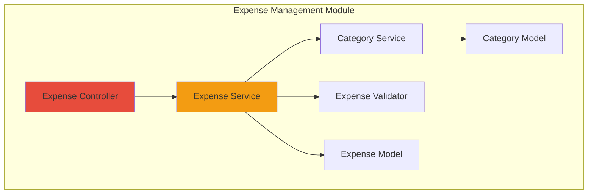

#### API Endpoints

| Method | Endpoint | Description | Auth Required |
|--------|----------|-------------|---------------|
| POST | `/api/expenses` | Create new expense | Yes |
| GET | `/api/expenses` | List expenses (paginated) | Yes |
| GET | `/api/expenses/:id` | Get expense details | Yes |
| PUT | `/api/expenses/:id` | Update expense | Yes |
| DELETE | `/api/expenses/:id` | Delete expense | Yes |
| GET | `/api/expenses/stats` | Get expense statistics | Yes |

#### Data Models

```javascript
// Expense Model
{
  id: UUID,
  userId: UUID,
  amount: Decimal,
  currency: String (default: 'INR'),
  category: String,
  merchant: String (optional),
  description: String (optional),
  date: Date,
  paymentMethod: Enum ['cash', 'upi', 'card', 'netbanking'],
  tags: Array<String>,
  isRecurring: Boolean,
  subscriptionId: UUID (nullable),
  createdAt: Timestamp,
  updatedAt: Timestamp,
  syncStatus: Enum ['synced', 'pending', 'conflict']
}

// Category Model
{
  id: UUID,
  name: String,
  icon: String,
  color: String,
  isDefault: Boolean,
  userId: UUID (nullable for system categories)
}
```

#### Business Rules
- Amount must be positive
- Date cannot be in future (with 24hr tolerance)
- Category must exist or be created
- Duplicate detection window: 5 minutes, same amount+merchant

---

### 2.3 Subscription Intelligence Module

#### Responsibilities
- Detect recurring payment patterns
- Create subscription records
- Schedule renewal reminders
- Calculate subscription costs
- Identify unused subscriptions

#### Components

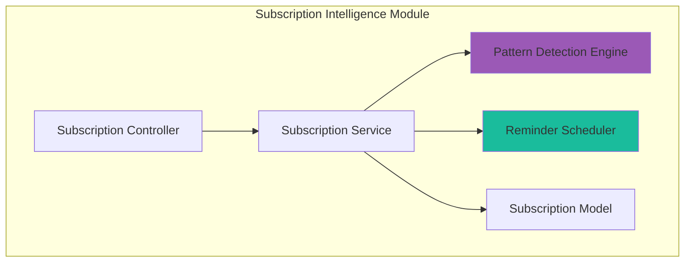

#### Detection Algorithm

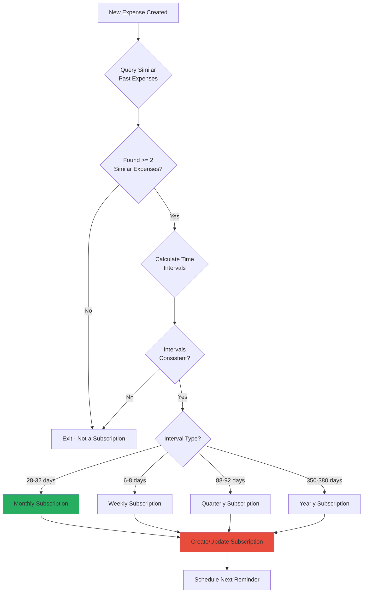

#### Similarity Criteria
```javascript
function isSimilarExpense(expense1, expense2) {
  const amountMatch = Math.abs(expense1.amount - expense2.amount) < 5; // ₹5 tolerance
  const merchantMatch = expense1.merchant === expense2.merchant;
  const categoryMatch = expense1.category === expense2.category;
  
  return amountMatch && (merchantMatch || categoryMatch);
}
```

#### API Endpoints

| Method | Endpoint | Description | Auth Required |
|--------|----------|-------------|---------------|
| GET | `/api/subscriptions` | List all subscriptions | Yes |
| GET | `/api/subscriptions/:id` | Get subscription details | Yes |
| PUT | `/api/subscriptions/:id` | Update subscription | Yes |
| DELETE | `/api/subscriptions/:id` | Cancel subscription | Yes |
| POST | `/api/subscriptions/:id/pause` | Pause subscription tracking | Yes |
| GET | `/api/subscriptions/upcoming` | Get upcoming renewals | Yes |

#### Data Models

```javascript
// Subscription Model
{
  id: UUID,
  userId: UUID,
  name: String,
  amount: Decimal,
  currency: String,
  frequency: Enum ['weekly', 'monthly', 'quarterly', 'yearly'],
  startDate: Date,
  nextRenewalDate: Date,
  lastPaymentDate: Date,
  category: String,
  merchant: String,
  status: Enum ['active', 'paused', 'cancelled'],
  reminderDays: Integer (default: 3),
  relatedExpenseIds: Array<UUID>,
  createdAt: Timestamp,
  updatedAt: Timestamp
}
```

---

### 2.4 Budget Management Module

#### Responsibilities
- Create and manage budgets
- Track spending against budgets
- Alert when approaching limits
- Support category-based budgets
- Calculate budget utilization

#### Components

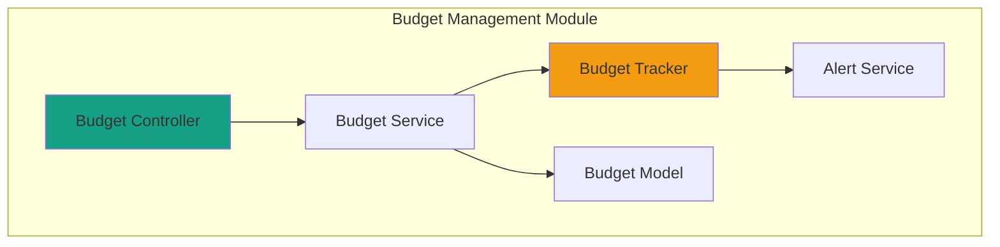

#### API Endpoints

| Method | Endpoint | Description | Auth Required |
|--------|----------|-------------|---------------|
| POST | `/api/budgets` | Create new budget | Yes |
| GET | `/api/budgets` | List all budgets | Yes |
| GET | `/api/budgets/:id` | Get budget details | Yes |
| PUT | `/api/budgets/:id` | Update budget | Yes |
| DELETE | `/api/budgets/:id` | Delete budget | Yes |
| GET | `/api/budgets/:id/progress` | Get budget progress | Yes |

#### Data Models

```javascript
// Budget Model
{
  id: UUID,
  userId: UUID,
  name: String,
  amount: Decimal,
  period: Enum ['weekly', 'monthly', 'yearly'],
  category: String (nullable - null means overall budget),
  startDate: Date,
  endDate: Date,
  alertThreshold: Integer (percentage, default: 80),
  currentSpent: Decimal (calculated),
  status: Enum ['active', 'completed', 'exceeded'],
  createdAt: Timestamp,
  updatedAt: Timestamp
}
```

#### Budget Calculation Logic

```javascript
function calculateBudgetProgress(budget, expenses) {
  const relevantExpenses = expenses.filter(exp => {
    const inDateRange = exp.date >= budget.startDate && exp.date <= budget.endDate;
    const matchesCategory = !budget.category || exp.category === budget.category;
    return inDateRange && matchesCategory;
  });
  
  const totalSpent = relevantExpenses.reduce((sum, exp) => sum + exp.amount, 0);
  const percentage = (totalSpent / budget.amount) * 100;
  
  return {
    spent: totalSpent,
    remaining: budget.amount - totalSpent,
    percentage: percentage,
    isExceeded: percentage > 100,
    shouldAlert: percentage >= budget.alertThreshold
  };
}
```

---

### 2.5 Analytics Module

#### Responsibilities
- Aggregate spending data
- Generate insights and trends
- Detect spending anomalies
- Category-wise breakdown
- Time-series analysis

#### Components

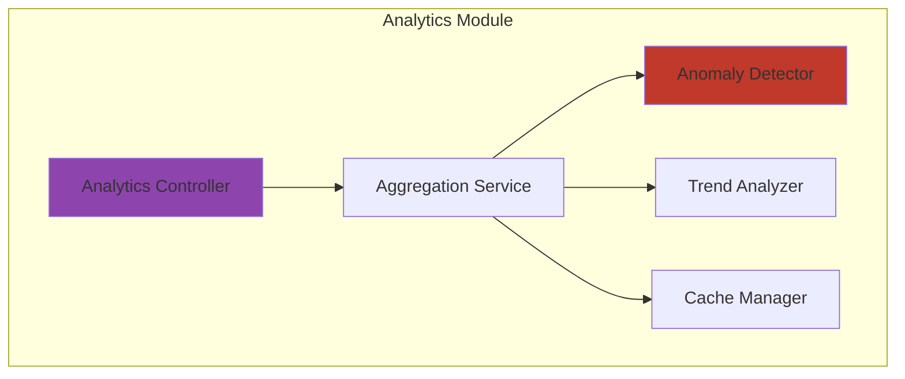

#### API Endpoints

| Method | Endpoint | Description | Auth Required |
|--------|----------|-------------|---------------|
| GET | `/api/analytics/summary` | Overall spending summary | Yes |
| GET | `/api/analytics/category-breakdown` | Spending by category | Yes |
| GET | `/api/analytics/trends` | Monthly/weekly trends | Yes |
| GET | `/api/analytics/anomalies` | Unusual spending patterns | Yes |
| GET | `/api/analytics/comparison` | Period-over-period comparison | Yes |

#### Anomaly Detection Algorithm

```javascript
function detectAnomalies(expenses, category) {
  // Calculate average and standard deviation
  const amounts = expenses.filter(e => e.category === category).map(e => e.amount);
  const mean = amounts.reduce((a, b) => a + b, 0) / amounts.length;
  const variance = amounts.reduce((sum, val) => sum + Math.pow(val - mean, 2), 0) / amounts.length;
  const stdDev = Math.sqrt(variance);
  
  // Detect outliers (> 2 standard deviations)
  const threshold = mean + (2 * stdDev);
  
  return expenses.filter(e => e.category === category && e.amount > threshold);
}
```

---

## 3. Mobile Application Modules

### 3.1 UI Components Module

#### Responsibilities
- Reusable UI components
- Consistent design system
- Form inputs and validation
- Navigation structure
- Theme management

#### Component Hierarchy

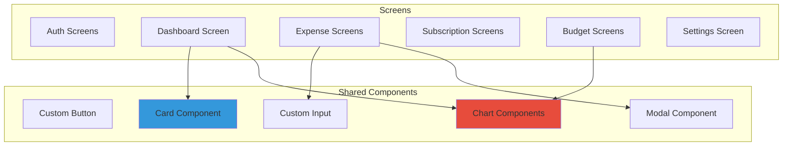

#### Component List

| Component | Purpose | Props |
|-----------|---------|-------|
| `ExpenseCard` | Display expense item | `expense`, `onPress`, `onDelete` |
| `CategoryPicker` | Select category | `value`, `onChange`, `categories` |
| `AmountInput` | Currency input | `value`, `onChange`, `currency` |
| `DatePicker` | Date selection | `value`, `onChange`, `maxDate` |
| `BudgetProgressBar` | Visual budget progress | `spent`, `total`, `color` |
| `SubscriptionCard` | Display subscription | `subscription`, `onPress` |
| `PieChart` | Category breakdown | `data`, `colors` |
| `LineChart` | Trend visualization | `data`, `period` |

#### Screen Structure

```javascript
// Navigation Structure
const AppNavigator = () => (
  <Stack.Navigator>
    <Stack.Screen name="AuthStack">
      <Stack.Screen name="Login" />
      <Stack.Screen name="Register" />
    </Stack.Screen>
    
    <Stack.Screen name="MainTabs">
      <Tab.Screen name="Dashboard" />
      <Tab.Screen name="Expenses" />
      <Tab.Screen name="Subscriptions" />
      <Tab.Screen name="Budgets" />
      <Tab.Screen name="Profile" />
    </Stack.Screen>
  </Stack.Navigator>
);
```

---

### 3.2 Data Persistence Module

#### Responsibilities
- Local SQLite database management
- Offline data storage
- Sync queue management
- Conflict resolution
- Data encryption

#### Components

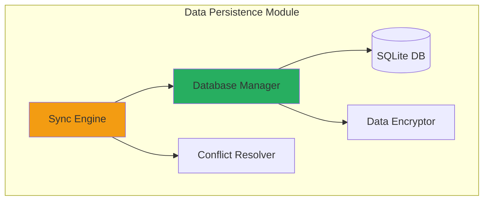

#### Database Schema

```sql
-- Users table
CREATE TABLE users (
  id TEXT PRIMARY KEY,
  email TEXT UNIQUE NOT NULL,
  name TEXT,
  sync_token TEXT,
  last_sync DATETIME
);

-- Expenses table
CREATE TABLE expenses (
  id TEXT PRIMARY KEY,
  user_id TEXT NOT NULL,
  amount REAL NOT NULL,
  currency TEXT DEFAULT 'INR',
  category TEXT NOT NULL,
  merchant TEXT,
  description TEXT,
  date DATE NOT NULL,
  payment_method TEXT,
  tags TEXT, -- JSON array
  is_recurring INTEGER DEFAULT 0,
  subscription_id TEXT,
  sync_status TEXT DEFAULT 'pending', -- 'synced', 'pending', 'conflict'
  server_id TEXT, -- ID from backend
  created_at DATETIME DEFAULT CURRENT_TIMESTAMP,
  updated_at DATETIME DEFAULT CURRENT_TIMESTAMP,
  FOREIGN KEY (user_id) REFERENCES users(id)
);

-- Subscriptions table
CREATE TABLE subscriptions (
  id TEXT PRIMARY KEY,
  user_id TEXT NOT NULL,
  name TEXT NOT NULL,
  amount REAL NOT NULL,
  frequency TEXT NOT NULL,
  next_renewal_date DATE,
  status TEXT DEFAULT 'active',
  sync_status TEXT DEFAULT 'pending',
  server_id TEXT,
  created_at DATETIME DEFAULT CURRENT_TIMESTAMP,
  FOREIGN KEY (user_id) REFERENCES users(id)
);

-- Budgets table
CREATE TABLE budgets (
  id TEXT PRIMARY KEY,
  user_id TEXT NOT NULL,
  name TEXT NOT NULL,
  amount REAL NOT NULL,
  period TEXT NOT NULL,
  category TEXT,
  start_date DATE NOT NULL,
  end_date DATE NOT NULL,
  alert_threshold INTEGER DEFAULT 80,
  sync_status TEXT DEFAULT 'pending',
  server_id TEXT,
  created_at DATETIME DEFAULT CURRENT_TIMESTAMP,
  FOREIGN KEY (user_id) REFERENCES users(id)
);

-- Sync Queue table
CREATE TABLE sync_queue (
  id INTEGER PRIMARY KEY AUTOINCREMENT,
  entity_type TEXT NOT NULL, -- 'expense', 'budget', 'subscription'
  entity_id TEXT NOT NULL,
  operation TEXT NOT NULL, -- 'create', 'update', 'delete'
  payload TEXT NOT NULL, -- JSON
  retry_count INTEGER DEFAULT 0,
  created_at DATETIME DEFAULT CURRENT_TIMESTAMP
);
```

#### Sync Strategy

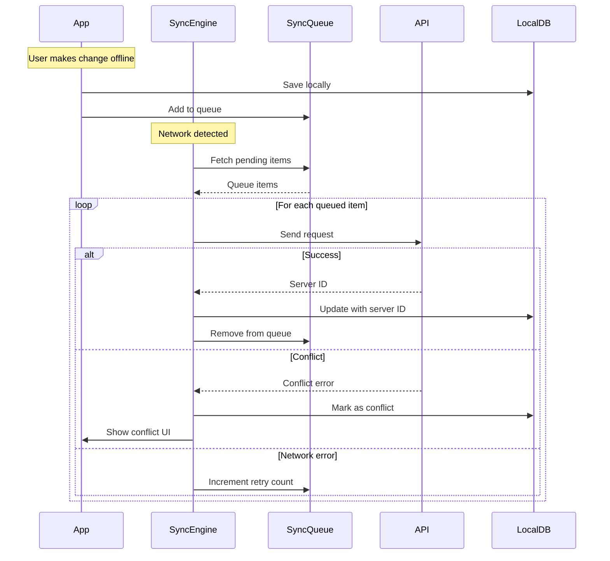

---

### 3.3 Business Logic Module

#### Responsibilities
- Client-side validation
- Local subscription detection
- Budget calculations
- Data formatting
- Business rule enforcement

#### Components

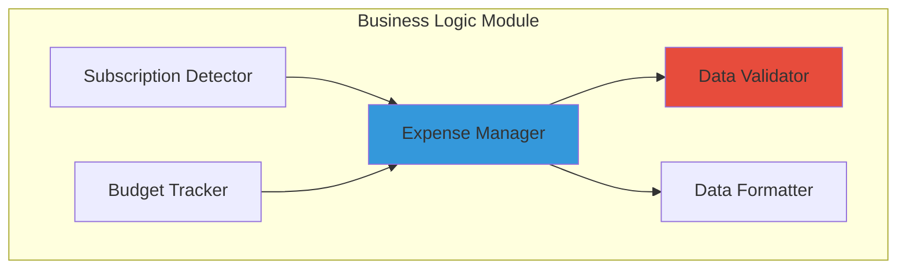

#### Key Functions

```javascript
// Expense Manager
class ExpenseManager {
  async createExpense(expenseData) {
    // Validate
    const errors = this.validator.validateExpense(expenseData);
    if (errors.length > 0) throw new ValidationError(errors);
    
    // Format
    const formatted = this.formatter.formatExpense(expenseData);
    
    // Save locally
    const localId = await this.db.insertExpense(formatted);
    
    // Queue for sync
    await this.syncQueue.add('expense', localId, 'create', formatted);
    
    // Trigger subscription detection
    await this.subDetector.checkForSubscription(formatted);
    
    return localId;
  }
  
  async getExpenses(filters) {
    return await this.db.getExpenses(filters);
  }
}

// Budget Tracker
class BudgetTracker {
  async calculateProgress(budgetId) {
    const budget = await this.db.getBudget(budgetId);
    const expenses = await this.db.getExpenses({
      startDate: budget.startDate,
      endDate: budget.endDate,
      category: budget.category
    });
    
    const spent = expenses.reduce((sum, exp) => sum + exp.amount, 0);
    const percentage = (spent / budget.amount) * 100;
    
    return {
      spent,
      remaining: budget.amount - spent,
      percentage,
      isExceeded: percentage > 100
    };
  }
}
```

---

## 4. Shared/Common Modules

### 4.1 Utilities Module

- **Date Utilities**: Formatting, parsing, range calculations
- **Currency Utilities**: Formatting, conversion
- **Validation Utilities**: Email, phone, amount validation
- **String Utilities**: Capitalization, truncation
- **Color Utilities**: Theme colors, category colors

### 4.2 Constants Module

```javascript
// Category Constants
export const CATEGORIES = [
  { name: 'Food & Dining', icon: 'restaurant', color: '#E74C3C' },
  { name: 'Transportation', icon: 'car', color: '#3498DB' },
  { name: 'Entertainment', icon: 'movie', color: '#9B59B6' },
  { name: 'Shopping', icon: 'shopping-cart', color: '#F39C12' },
  { name: 'Bills & Utilities', icon: 'receipt', color: '#16A085' },
  { name: 'Health', icon: 'fitness', color: '#27AE60' },
  { name: 'Education', icon: 'school', color: '#2C3E50' },
  { name: 'Others', icon: 'ellipsis-horizontal', color: '#95A5A6' }
];

// Payment Method Constants
export const PAYMENT_METHODS = ['Cash', 'UPI', 'Credit Card', 'Debit Card', 'Net Banking'];

// Subscription Frequencies
export const FREQUENCIES = ['Weekly', 'Monthly', 'Quarterly', 'Yearly'];
```

---

## 5. Module Interaction Patterns

### 5.1 Cross-Module Communication

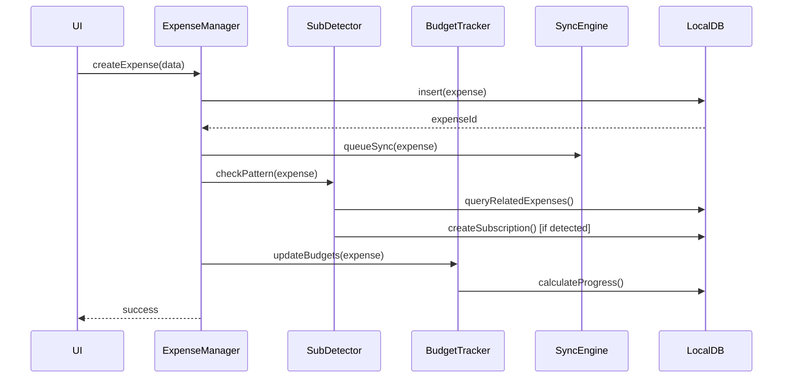

### 5.2 Error Handling Pattern

All modules follow consistent error handling:

```javascript
class AppError extends Error {
  constructor(message, code, statusCode = 500) {
    super(message);
    this.code = code;
    this.statusCode = statusCode;
  }
}

// Usage
throw new AppError('Invalid expense amount', 'INVALID_AMOUNT', 400);
```

### 5.3 Dependency Injection

```javascript
// Example: Expense Service with injected dependencies
class ExpenseService {
  constructor(expenseRepository, subscriptionDetector, eventEmitter) {
    this.repository = expenseRepository;
    this.detector = subscriptionDetector;
    this.events = eventEmitter;
  }
  
  async createExpense(data) {
    const expense = await this.repository.create(data);
    this.events.emit('expense:created', expense);
    await this.detector.analyze(expense);
    return expense;
  }
}
```

---

## 6. Module Testing Strategy

| Module | Test Type | Coverage Target |
|--------|-----------|-----------------|
| Authentication | Unit + Integration | 90% |
| Expense Management | Unit + Integration | 85% |
| Subscription Detection | Unit + E2E | 80% |
| Budget Tracking | Unit | 85% |
| Analytics | Unit | 75% |
| UI Components | Snapshot + Unit | 70% |
| Data Persistence | Integration | 90% |

---

**Document Version**: 1.0  
**Last Updated**: February 12, 2026  
**Authors**: Aarya Patil, Prathmesh Bhardwaj  
**Project**: SyncSpend - Module Design Specification
