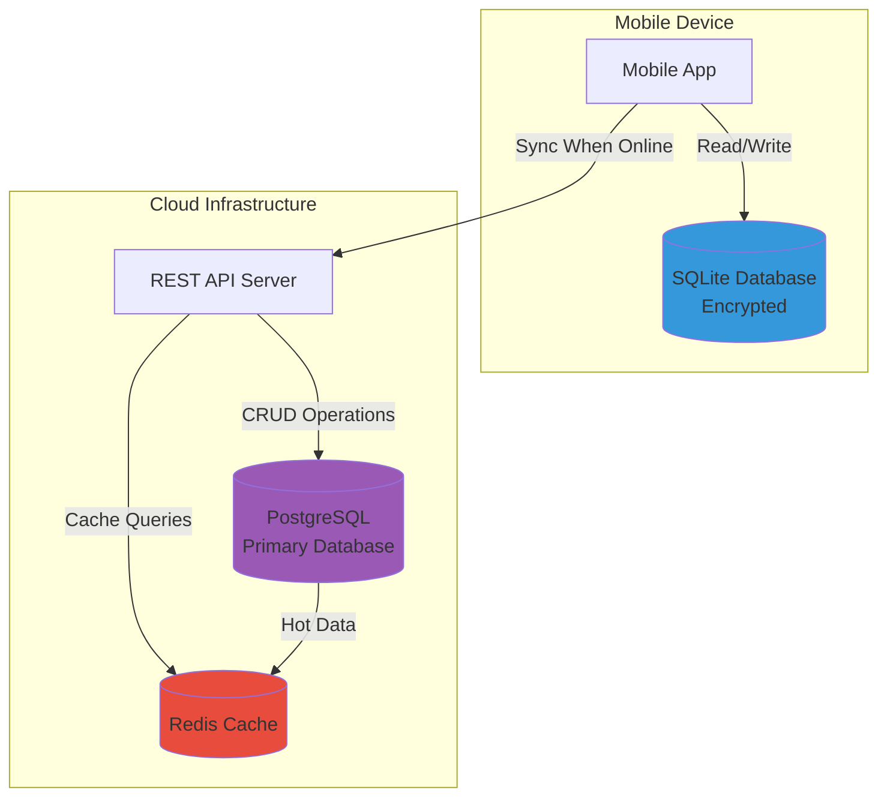
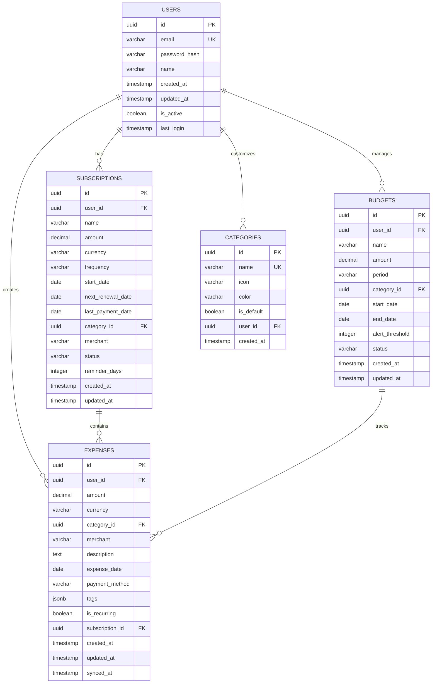
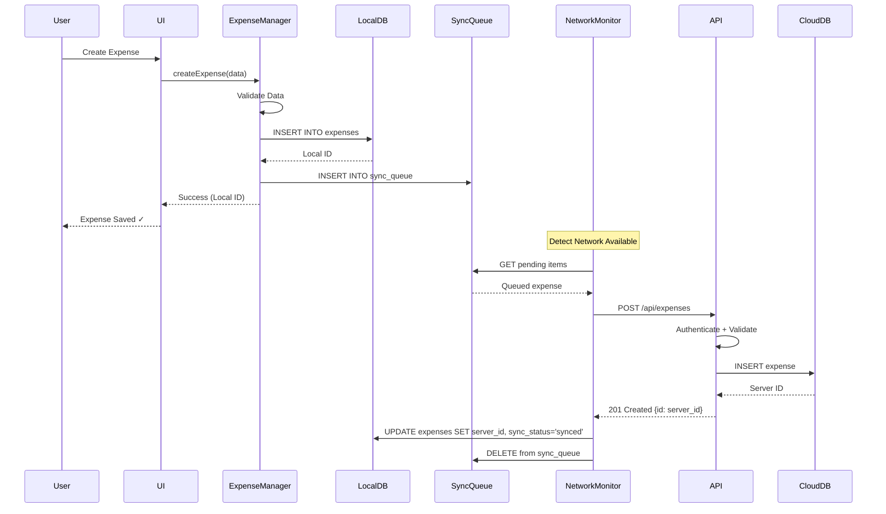
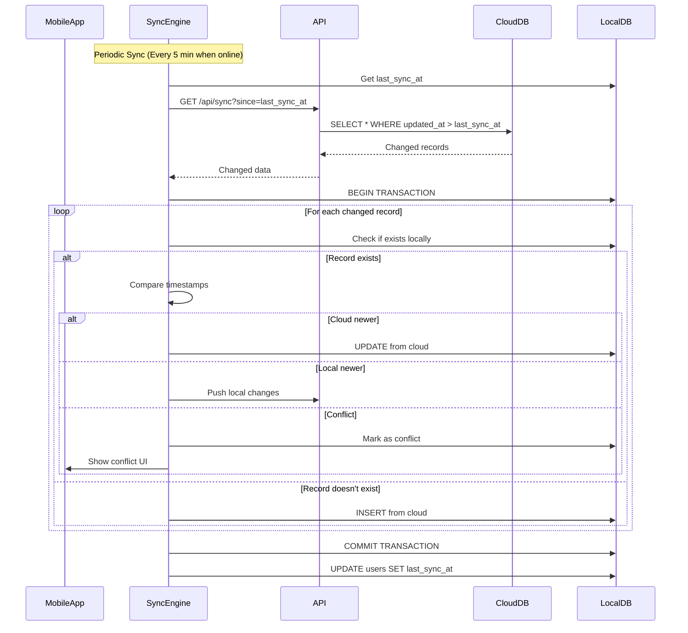
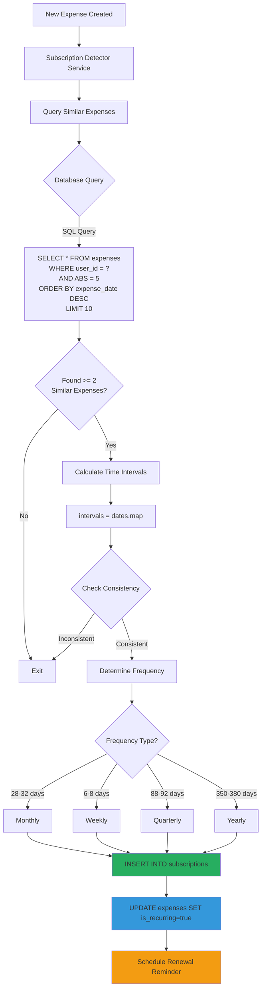
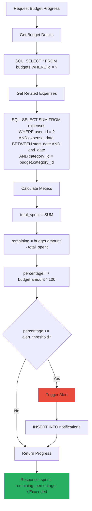

# SyncSpend - Database & Data Flow Design

## Table of Contents
1. [Database Architecture Overview](#database-architecture-overview)
2. [PostgreSQL Schema (Cloud Database)](#postgresql-schema-cloud-database)
3. [SQLite Schema (Mobile Local Database)](#sqlite-schema-mobile-local-database)
4. [Data Flow Diagrams](#data-flow-diagrams)
5. [Synchronization Strategy](#synchronization-strategy)
6. [Indexing Strategy](#indexing-strategy)
7. [Data Integrity & Constraints](#data-integrity--constraints)
8. [Backup & Recovery](#backup--recovery)

---

## 1. Database Architecture Overview

SyncSpend uses a **dual-database architecture**:



### Design Principles

1. **Offline-First**: All data operations work offline, sync when online
2. **Privacy-First**: Minimal data collection, encryption at rest and in transit
3. **Conflict Resolution**: Last-write-wins with timestamp comparison
4. **Data Minimization**: Only essential data stored in cloud
5. **Eventual Consistency**: Local and cloud databases sync asynchronously

---

## 2. PostgreSQL Schema (Cloud Database)

### 2.1 Entity Relationship Diagram



### 2.2 Table Schemas

#### 2.2.1 Users Table

```sql
CREATE TABLE users (
    id UUID PRIMARY KEY DEFAULT gen_random_uuid(),
    email VARCHAR(255) UNIQUE NOT NULL,
    password_hash VARCHAR(255) NOT NULL,
    name VARCHAR(100) NOT NULL,
    created_at TIMESTAMP DEFAULT CURRENT_TIMESTAMP,
    updated_at TIMESTAMP DEFAULT CURRENT_TIMESTAMP,
    is_active BOOLEAN DEFAULT TRUE,
    last_login TIMESTAMP,
    
    CONSTRAINT email_format CHECK (email ~* '^[A-Za-z0-9._%+-]+@[A-Za-z0-9.-]+\.[A-Z|a-z]{2,}$')
);

-- Indexes
CREATE INDEX idx_users_email ON users(email);
CREATE INDEX idx_users_active ON users(is_active) WHERE is_active = TRUE;
```

#### 2.2.2 Categories Table

```sql
CREATE TABLE categories (
    id UUID PRIMARY KEY DEFAULT gen_random_uuid(),
    name VARCHAR(50) NOT NULL,
    icon VARCHAR(50) DEFAULT 'tag',
    color VARCHAR(7) DEFAULT '#95A5A6', -- Hex color
    is_default BOOLEAN DEFAULT FALSE,
    user_id UUID REFERENCES users(id) ON DELETE CASCADE,
    created_at TIMESTAMP DEFAULT CURRENT_TIMESTAMP,
    
    CONSTRAINT unique_category_per_user UNIQUE (user_id, name),
    CONSTRAINT unique_default_category UNIQUE (name) WHERE is_default = TRUE
);

-- Indexes
CREATE INDEX idx_categories_user ON categories(user_id);
CREATE INDEX idx_categories_default ON categories(is_default) WHERE is_default = TRUE;

-- Default Categories
INSERT INTO categories (name, icon, color, is_default) VALUES
    ('Food & Dining', 'restaurant', '#E74C3C', TRUE),
    ('Transportation', 'car', '#3498DB', TRUE),
    ('Entertainment', 'movie', '#9B59B6', TRUE),
    ('Shopping', 'cart', '#F39C12', TRUE),
    ('Bills & Utilities', 'receipt', '#16A085', TRUE),
    ('Health', 'fitness', '#27AE60', TRUE),
    ('Education', 'school', '#2C3E50', TRUE),
    ('Others', 'ellipsis-horizontal', '#95A5A6', TRUE);
```

#### 2.2.3 Expenses Table

```sql
CREATE TABLE expenses (
    id UUID PRIMARY KEY DEFAULT gen_random_uuid(),
    user_id UUID NOT NULL REFERENCES users(id) ON DELETE CASCADE,
    amount DECIMAL(12, 2) NOT NULL CHECK (amount > 0),
    currency VARCHAR(3) DEFAULT 'INR',
    category_id UUID NOT NULL REFERENCES categories(id) ON DELETE RESTRICT,
    merchant VARCHAR(100),
    description TEXT,
    expense_date DATE NOT NULL,
    payment_method VARCHAR(20) CHECK (payment_method IN ('cash', 'upi', 'card', 'netbanking', 'other')),
    tags JSONB DEFAULT '[]',
    is_recurring BOOLEAN DEFAULT FALSE,
    subscription_id UUID REFERENCES subscriptions(id) ON DELETE SET NULL,
    created_at TIMESTAMP DEFAULT CURRENT_TIMESTAMP,
    updated_at TIMESTAMP DEFAULT CURRENT_TIMESTAMP,
    synced_at TIMESTAMP DEFAULT CURRENT_TIMESTAMP,
    
    CONSTRAINT expense_date_not_future CHECK (expense_date <= CURRENT_DATE + INTERVAL '1 day')
);

-- Indexes (Critical for Performance)
CREATE INDEX idx_expenses_user ON expenses(user_id);
CREATE INDEX idx_expenses_date ON expenses(expense_date DESC);
CREATE INDEX idx_expenses_user_date ON expenses(user_id, expense_date DESC);
CREATE INDEX idx_expenses_category ON expenses(category_id);
CREATE INDEX idx_expenses_subscription ON expenses(subscription_id) WHERE subscription_id IS NOT NULL;
CREATE INDEX idx_expenses_merchant ON expenses(merchant) WHERE merchant IS NOT NULL;
CREATE INDEX idx_expenses_tags ON expenses USING GIN(tags);

-- Trigger for updated_at
CREATE OR REPLACE FUNCTION update_updated_at_column()
RETURNS TRIGGER AS $$
BEGIN
    NEW.updated_at = CURRENT_TIMESTAMP;
    RETURN NEW;
END;
$$ language 'plpgsql';

CREATE TRIGGER update_expenses_updated_at BEFORE UPDATE ON expenses
    FOR EACH ROW EXECUTE FUNCTION update_updated_at_column();
```

#### 2.2.4 Subscriptions Table

```sql
CREATE TABLE subscriptions (
    id UUID PRIMARY KEY DEFAULT gen_random_uuid(),
    user_id UUID NOT NULL REFERENCES users(id) ON DELETE CASCADE,
    name VARCHAR(100) NOT NULL,
    amount DECIMAL(10, 2) NOT NULL CHECK (amount > 0),
    currency VARCHAR(3) DEFAULT 'INR',
    frequency VARCHAR(20) NOT NULL CHECK (frequency IN ('weekly', 'monthly', 'quarterly', 'yearly')),
    start_date DATE NOT NULL,
    next_renewal_date DATE NOT NULL,
    last_payment_date DATE,
    category_id UUID NOT NULL REFERENCES categories(id) ON DELETE RESTRICT,
    merchant VARCHAR(100),
    status VARCHAR(20) DEFAULT 'active' CHECK (status IN ('active', 'paused', 'cancelled')),
    reminder_days INTEGER DEFAULT 3 CHECK (reminder_days >= 0 AND reminder_days <= 30),
    created_at TIMESTAMP DEFAULT CURRENT_TIMESTAMP,
    updated_at TIMESTAMP DEFAULT CURRENT_TIMESTAMP
);

-- Indexes
CREATE INDEX idx_subscriptions_user ON subscriptions(user_id);
CREATE INDEX idx_subscriptions_status ON subscriptions(status) WHERE status = 'active';
CREATE INDEX idx_subscriptions_next_renewal ON subscriptions(next_renewal_date) WHERE status = 'active';
CREATE INDEX idx_subscriptions_merchant ON subscriptions(merchant);

-- Trigger for updated_at
CREATE TRIGGER update_subscriptions_updated_at BEFORE UPDATE ON subscriptions
    FOR EACH ROW EXECUTE FUNCTION update_updated_at_column();
```

#### 2.2.5 Budgets Table

```sql
CREATE TABLE budgets (
    id UUID PRIMARY KEY DEFAULT gen_random_uuid(),
    user_id UUID NOT NULL REFERENCES users(id) ON DELETE CASCADE,
    name VARCHAR(100) NOT NULL,
    amount DECIMAL(12, 2) NOT NULL CHECK (amount > 0),
    period VARCHAR(20) NOT NULL CHECK (period IN ('weekly', 'monthly', 'yearly')),
    category_id UUID REFERENCES categories(id) ON DELETE RESTRICT,
    start_date DATE NOT NULL,
    end_date DATE NOT NULL,
    alert_threshold INTEGER DEFAULT 80 CHECK (alert_threshold >= 0 AND alert_threshold <= 100),
    status VARCHAR(20) DEFAULT 'active' CHECK (status IN ('active', 'completed', 'exceeded')),
    created_at TIMESTAMP DEFAULT CURRENT_TIMESTAMP,
    updated_at TIMESTAMP DEFAULT CURRENT_TIMESTAMP,
    
    CONSTRAINT budget_date_range CHECK (end_date > start_date),
    CONSTRAINT unique_budget_per_period UNIQUE (user_id, category_id, start_date, end_date)
);

-- Indexes  
CREATE INDEX idx_budgets_user ON budgets(user_id);
CREATE INDEX idx_budgets_period ON budgets(start_date, end_date);
CREATE INDEX idx_budgets_status ON budgets(status) WHERE status = 'active';

-- Trigger for updated_at
CREATE TRIGGER update_budgets_updated_at BEFORE UPDATE ON budgets
    FOR EACH ROW EXECUTE FUNCTION update_updated_at_column();
```

---

## 3. SQLite Schema (Mobile Local Database)

### 3.1 Key Differences from PostgreSQL

- **UUID**: TEXT instead of UUID type
- **JSONB**: TEXT (JSON stored as string)
- **Sync fields**: Additional columns for offline sync management

### 3.2 Table Schemas

```sql
-- Enable foreign keys
PRAGMA foreign_keys = ON;

-- Users table
CREATE TABLE users (
    id TEXT PRIMARY KEY,
    email TEXT UNIQUE NOT NULL,
    name TEXT,
    sync_token TEXT,
    last_sync_at TEXT,
    created_at TEXT DEFAULT (datetime('now'))
);

-- Categories table
CREATE TABLE categories (
    id TEXT PRIMARY KEY,
    name TEXT NOT NULL,
    icon TEXT DEFAULT 'tag',
    color TEXT DEFAULT '#95A5A6',
    is_default INTEGER DEFAULT 0,
    user_id TEXT,
    server_id TEXT,
    sync_status TEXT DEFAULT 'synced',
    created_at TEXT DEFAULT (datetime('now')),
    FOREIGN KEY (user_id) REFERENCES users(id) ON DELETE CASCADE
);

CREATE INDEX idx_local_categories_user ON categories(user_id);

-- Expenses table
CREATE TABLE expenses (
    id TEXT PRIMARY KEY,
    user_id TEXT NOT NULL,
    amount REAL NOT NULL,
    currency TEXT DEFAULT 'INR',
    category_id TEXT NOT NULL,
    merchant TEXT,
    description TEXT,
    expense_date TEXT NOT NULL,
    payment_method TEXT,
    tags TEXT DEFAULT '[]',
    is_recurring INTEGER DEFAULT 0,
    subscription_id TEXT,
    sync_status TEXT DEFAULT 'pending', -- 'pending', 'synced', 'conflict'
    server_id TEXT, -- UUID from cloud database
    created_at TEXT DEFAULT (datetime('now')),
    updated_at TEXT DEFAULT (datetime('now')),
    FOREIGN KEY (user_id) REFERENCES users(id) ON DELETE CASCADE,
    FOREIGN KEY (category_id) REFERENCES categories(id) ON DELETE RESTRICT,
    FOREIGN KEY (subscription_id) REFERENCES subscriptions(id) ON DELETE SET NULL
);

CREATE INDEX idx_local_expenses_user ON expenses(user_id);
CREATE INDEX idx_local_expenses_date ON expenses(expense_date DESC);
CREATE INDEX idx_local_expenses_sync_status ON expenses(sync_status) WHERE sync_status != 'synced';
CREATE INDEX idx_local_expenses_merchant ON expenses(merchant);

-- Subscriptions table
CREATE TABLE subscriptions (
    id TEXT PRIMARY KEY,
    user_id TEXT NOT NULL,
    name TEXT NOT NULL,
    amount REAL NOT NULL,
    currency TEXT DEFAULT 'INR',
    frequency TEXT NOT NULL,
    start_date TEXT NOT NULL,
    next_renewal_date TEXT NOT NULL,
    last_payment_date TEXT,
    category_id TEXT NOT NULL,
    merchant TEXT,
    status TEXT DEFAULT 'active',
    reminder_days INTEGER DEFAULT 3,
    sync_status TEXT DEFAULT 'pending',
    server_id TEXT,
    created_at TEXT DEFAULT (datetime('now')),
    updated_at TEXT DEFAULT (datetime('now')),
    FOREIGN KEY (user_id) REFERENCES users(id) ON DELETE CASCADE,
    FOREIGN KEY (category_id) REFERENCES categories(id) ON DELETE RESTRICT
);

CREATE INDEX idx_local_subscriptions_user ON subscriptions(user_id);
CREATE INDEX idx_local_subscriptions_renewal ON subscriptions(next_renewal_date);

-- Budgets table
CREATE TABLE budgets (
    id TEXT PRIMARY KEY,
    user_id TEXT NOT NULL,
    name TEXT NOT NULL,
    amount REAL NOT NULL,
    period TEXT NOT NULL,
    category_id TEXT,
    start_date TEXT NOT NULL,
    end_date TEXT NOT NULL,
    alert_threshold INTEGER DEFAULT 80,
    status TEXT DEFAULT 'active',
    sync_status TEXT DEFAULT 'pending',
    server_id TEXT,
    created_at TEXT DEFAULT (datetime('now')),
    updated_at TEXT DEFAULT (datetime('now')),
    FOREIGN KEY (user_id) REFERENCES users(id) ON DELETE CASCADE,
    FOREIGN KEY (category_id) REFERENCES categories(id) ON DELETE RESTRICT
);

CREATE INDEX idx_local_budgets_user ON budgets(user_id);
CREATE INDEX idx_local_budgets_period ON budgets(start_date, end_date);

-- Sync Queue table
CREATE TABLE sync_queue (
    id INTEGER PRIMARY KEY AUTOINCREMENT,
    entity_type TEXT NOT NULL, -- 'expense', 'subscription', 'budget', 'category'
    entity_id TEXT NOT NULL,
    operation TEXT NOT NULL, -- 'create', 'update', 'delete'
    payload TEXT NOT NULL, -- JSON
    retry_count INTEGER DEFAULT 0,
    last_error TEXT,
    created_at TEXT DEFAULT (datetime('now'))
);

CREATE INDEX idx_sync_queue_entity ON sync_queue(entity_type, entity_id);
CREATE INDEX idx_sync_queue_retry ON sync_queue(retry_count) WHERE retry_count < 3;
```

---

## 4. Data Flow Diagrams

### 4.1 Expense Creation Flow (Offline to Cloud)



### 4.2 Data Synchronization Flow



### 4.3 Subscription Detection Data Flow



### 4.4 Budget Progress Calculation Flow



---

## 5. Synchronization Strategy

### 5.1 Sync Trigger Events

1. **Periodic Sync**: Every 5 minutes when online
2. **App Resume**: When app comes to foreground
3. **Manual Sync**: User-initiated pull-to-refresh
4. **After Create/Update**: Immediate sync attempt (non-blocking)

### 5.2 Conflict Resolution

**Strategy**: Last-Write-Wins (LWW) based on `updated_at` timestamp

```javascript
function resolveConflict(localRecord, cloudRecord) {
  const localTime = new Date(localRecord.updated_at);
  const cloudTime = new Date(cloudRecord.updated_at);
  
  if (cloudTime > localTime) {
    // Cloud wins
    return {
      action: 'PULL',
      winner: cloudRecord,
      message: 'Cloud version is newer'
    };
  } else if (localTime > cloudTime) {
    // Local wins
    return {
      action: 'PUSH',
      winner: localRecord,
      message: 'Local version is newer'
    };
  } else {
    // Timestamps equal (rare edge case)
    // Use server as source of truth
    return {
      action: 'PULL',
      winner: cloudRecord,
      message: 'Timestamps equal, using server version'
    };
  }
}
```

### 5.3 Sync Algorithm

```sql
-- Sync Query (Get changes since last sync)
SELECT id, user_id, amount, category_id, merchant, description, 
       expense_date, payment_method, tags, is_recurring, 
       subscription_id, updated_at
FROM expenses
WHERE user_id = $1 
  AND updated_at > $2  -- $2 = last_sync_at
ORDER BY updated_at ASC
LIMIT 100;
```

---

## 6. Indexing Strategy

### 6.1 PostgreSQL Indexes

| Table | Index | Purpose | Type |
|-------|-------|---------|------|
| expenses | `idx_expenses_user_date` | List user's expenses by date | B-tree composite |
| expenses | `idx_expenses_merchant` | Subscription detection | B-tree partial |
| expenses | `idx_expenses_tags` | Tag-based filtering | GIN |
| subscriptions | `idx_subscriptions_next_renewal` | Renewal reminders | B-tree partial |
| budgets | `idx_budgets_period` | Active budgets lookup | B-tree composite |

### 6.2 Query Performance Targets

| Query Type | Target Time | Index Used |
|------------|-------------|------------|
| List expenses (1 month) | < 50ms | `idx_expenses_user_date` |
| Category breakdown | < 100ms | `idx_expenses_category` |
| Subscription detection | < 200ms | `idx_expenses_merchant` |
| Budget progress | < 75ms | `idx_budgets_period` |

---

## 7. Data Integrity & Constraints

### 7.1 Referential Integrity

- **ON DELETE CASCADE**: Users → Expenses, Subscriptions, Budgets
- **ON DELETE RESTRICT**: Categories → Expenses (prevent deletion if in use)
- **ON DELETE SET NULL**: Subscriptions → Expenses (preserve expense history)

### 7.2 Business Logic Constraints

```sql
-- Expense amount must be positive
CHECK (amount > 0)

-- Expense date cannot be too far in future (allows 1-day tolerance for timezone)
CHECK (expense_date <= CURRENT_DATE + INTERVAL '1 day')

-- Budget end date must be after start date
CHECK (end_date > start_date)

-- Alert threshold must be between 0 and 100
CHECK (alert_threshold >= 0 AND alert_threshold <= 100)
```

---

## 8. Backup & Recovery

### 8.1 Cloud Database (PostgreSQL)

- **Automated Backups**: Daily backups by hosting provider (Render)
- **Point-in-Time Recovery**: Up to 7 days
- **Manual Backups**: Weekly `pg_dump` to external storage

```bash
# Backup command
pg_dump $DATABASE_URL > backup_$(date +%Y%m%d).sql

# Restore command
psql $DATABASE_URL < backup_20260212.sql
```

### 8.2 Mobile Database (SQLite)

- **Export**: User can export all data as JSON
- **Cloud Sync**: Data automatically backed up to cloud when synced
- **Encryption**: SQLCipher ensures encrypted backups

---

**Document Version**: 1.0  
**Last Updated**: February 12, 2026  
**Authors**: Aarya Patil, Prathmesh Bhardwaj  
**Project**: SyncSpend - Database & Data Flow Design
