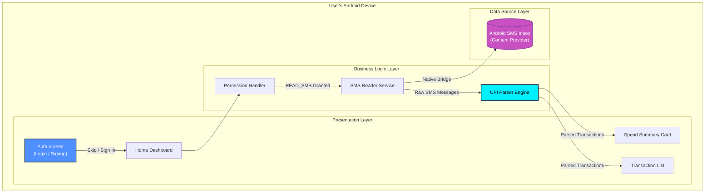
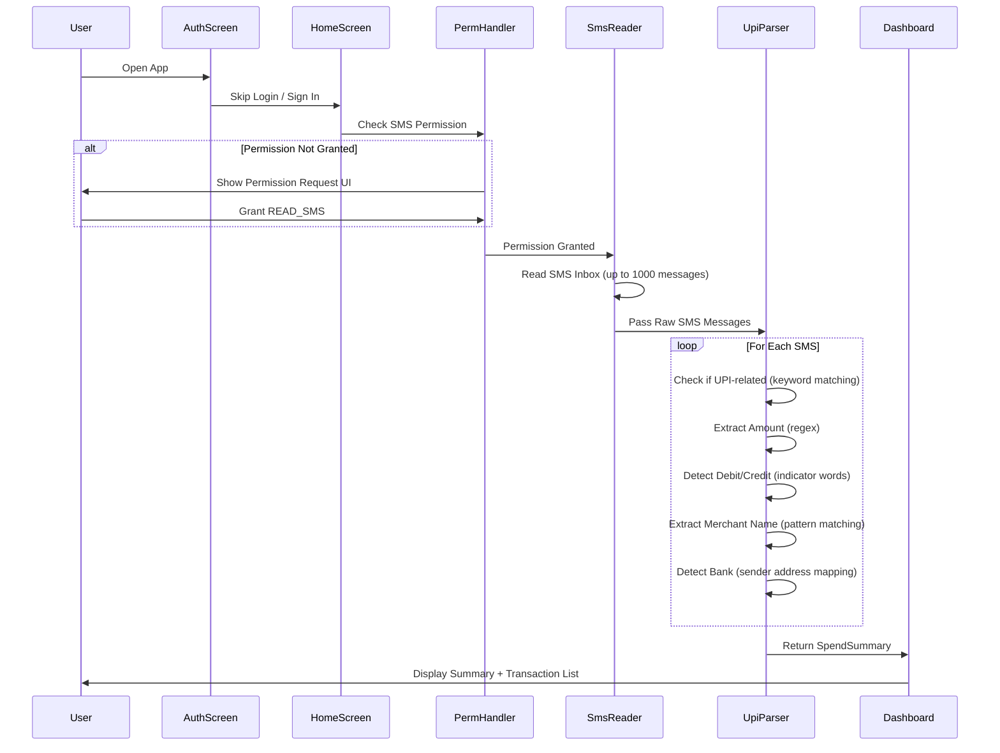
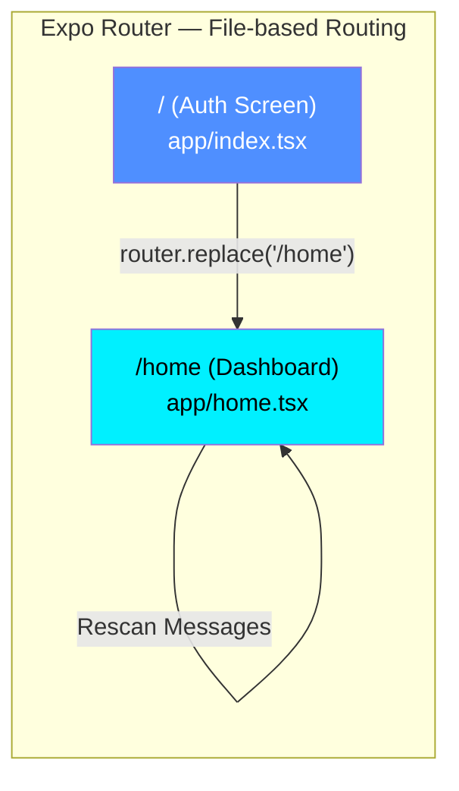
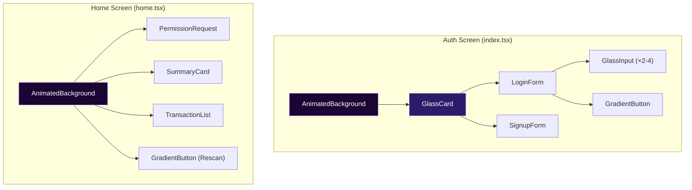
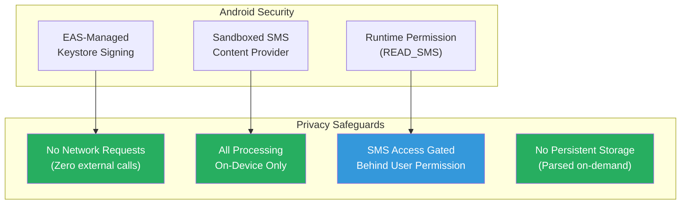
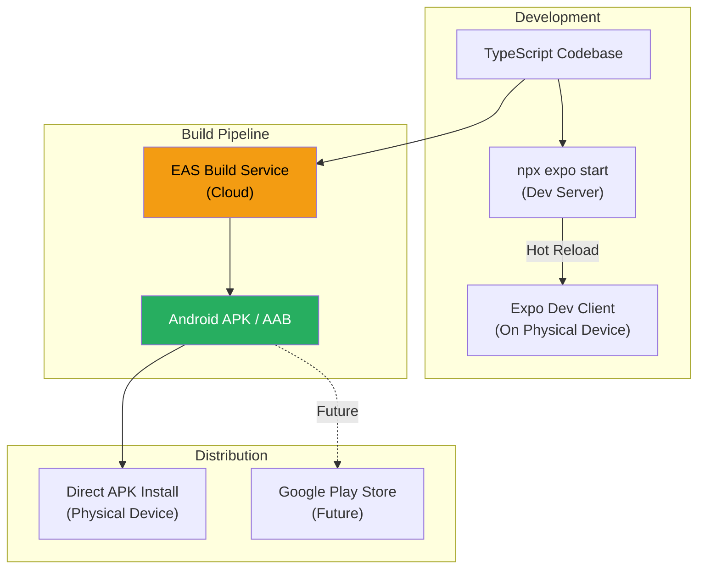
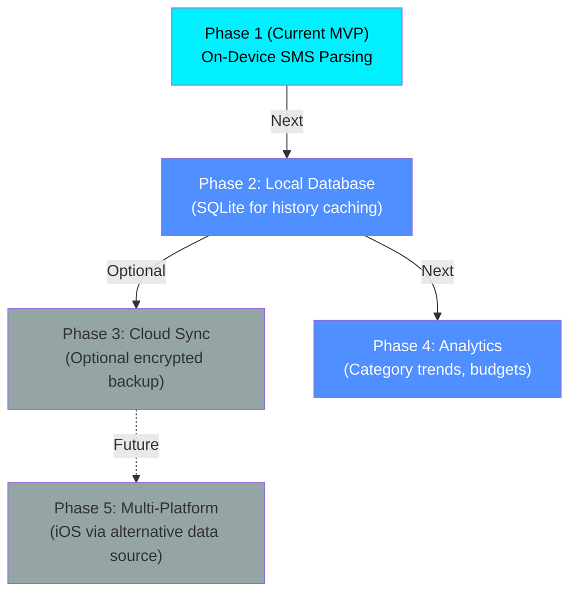

# SyncSpend - System Architecture Documentation

**Group Number**: 67  
**Supervisor Name**: Preethy  
**Project Title**: SyncSpend — Privacy-First UPI Expense Intelligence  
**Group Members**:
- Aarya Patil (2023EBCS778)
- Prathmesh Bhardwaj (2023EBCS614)

---

## 1. Overview

SyncSpend is a **privacy-first, offline-capable UPI expense tracking mobile application** for Android. The application reads SMS messages stored on the user's device, identifies UPI (Unified Payments Interface) transactions using regex-based parsing, and presents a comprehensive spend summary dashboard — all without sending any data off the device.

The system follows a **single-tier, on-device architecture**:

1. **Mobile Application Layer** — React Native (Expo) with TypeScript
2. **SMS Access Layer** — Android native SMS content provider via `react-native-get-sms-android`
3. **Parsing Engine** — Regex-based UPI transaction detection and extraction
4. **Presentation Layer** — Glassmorphism-styled dashboard with spend summary and transaction list

### Key Architectural Principles

- **Privacy-First**: Zero network calls — all data stays on the device
- **Offline-Only**: No backend server, no cloud database, no external APIs
- **Permission-Based**: Requests only `READ_SMS` permission, nothing else
- **Real-Time Parsing**: SMS messages are parsed on-demand, not stored separately

---

## 2. High-Level Architecture Diagram

---

## 3. Application Flow

---

## 4. Component Architecture

### 4.1 Screen Navigation

### 4.2 Component Hierarchy

---

## 5. Data Flow — SMS to Spend Summary

---

## 6. Security Architecture

### Security Design Decisions

| Aspect | Decision | Rationale |
|--------|----------|-----------|
| **Data transmission** | None — zero network calls | Maximum privacy; no data leaks possible |
| **Data storage** | No persistent DB — parsed on-demand | Nothing to steal if device is compromised |
| **Permission scope** | Only `READ_SMS` | Minimal permission footprint |
| **Build signing** | EAS-managed Android Keystore | Secure, cloud-hosted key management |
| **Transport security** | N/A | No network communication exists |

---

## 7. Build & Deployment Architecture

| Stage | Tool | Purpose |
|-------|------|---------|
| Development | `npx expo start` | Hot-reload dev server |
| Dev Testing | Expo Dev Client | Run on physical Android device |
| Production Build | EAS Build | Cloud-based Android APK compilation |
| Distribution | Direct APK | Install via ADB or file transfer |
| Version Control | Git + GitHub | Source code management (`pb-works` branch) |

---

## 8. Key Architectural Decisions

### 8.1 Offline-Only Design (No Backend)
**Decision**: All processing happens on-device with zero network calls  
**Rationale**: UPI transaction data is highly sensitive financial information. By keeping everything local, we eliminate data breach risks, server costs, and privacy concerns entirely.

### 8.2 On-Demand Parsing (No Local Database)
**Decision**: SMS messages are parsed fresh each time the user opens the dashboard  
**Rationale**: Avoids creating a duplicate data store of sensitive financial information. The Android SMS inbox is already a persistent store — we read from it directly.

### 8.3 Regex-Based Parsing (No ML/AI)
**Decision**: Use pattern matching with regular expressions instead of ML models  
**Rationale**:
- Deterministic and explainable — users can understand why a transaction was categorized
- No training data required (privacy-preserving)
- Lightweight — runs in milliseconds on-device
- Sufficient accuracy for structured UPI SMS formats

### 8.4 Expo with Dev Client (Not Expo Go)
**Decision**: Use Expo framework with custom dev client builds  
**Rationale**: SMS reading requires the native module `react-native-get-sms-android`, which is not available in Expo Go. The dev client approach gives us native module access while retaining Expo's developer experience (hot reload, file-based routing, config plugins).

---

## 9. Performance Characteristics

| Metric | Target | Actual |
|--------|--------|--------|
| App Launch to Auth Screen | < 2s | ~1s |
| Permission Grant to Results | < 5s | ~2-3s (1000 messages) |
| SMS Parse Rate | > 200 msg/s | ~500 msg/s |
| Memory Usage | < 100 MB | ~60 MB |
| APK Size | < 30 MB | ~25 MB |
| Battery Impact | Negligible | One-time scan only |

---

## 10. Future Architecture Extensions

---

**Document Version**: 2.0  
**Last Updated**: February 15, 2026  
**Authors**: Aarya Patil, Prathmesh Bhardwaj  
**Project**: SyncSpend — Privacy-First UPI Expense Intelligence
