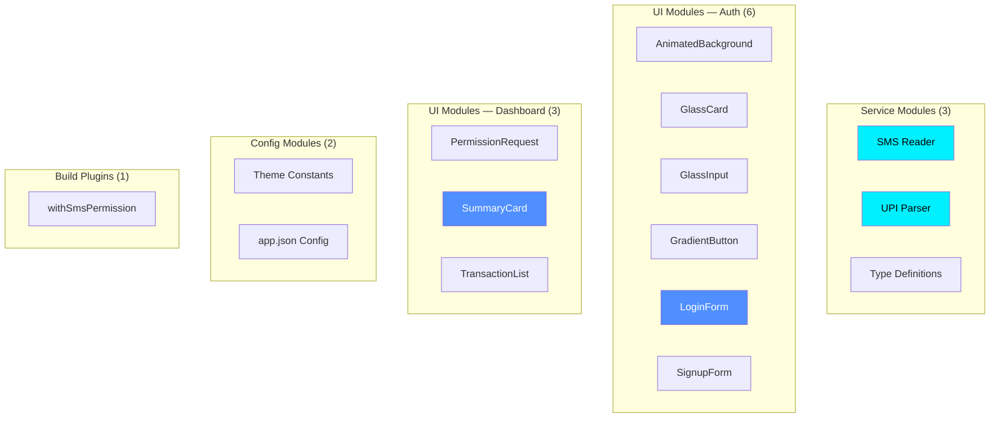
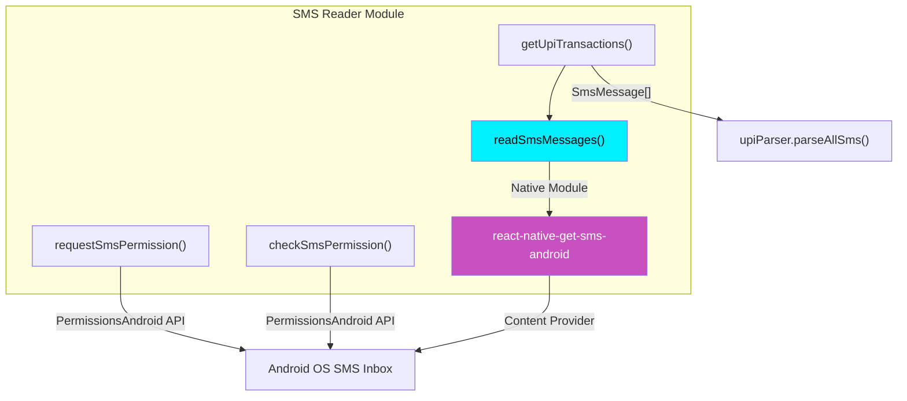
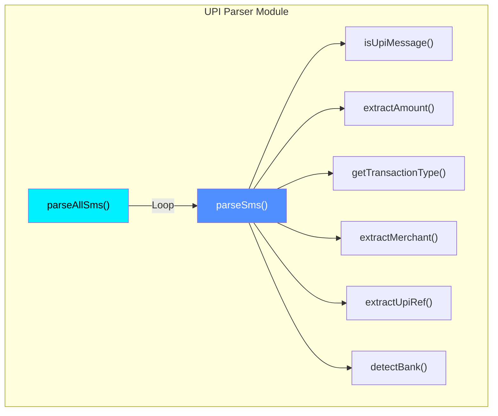
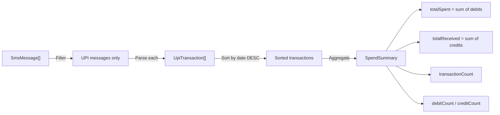
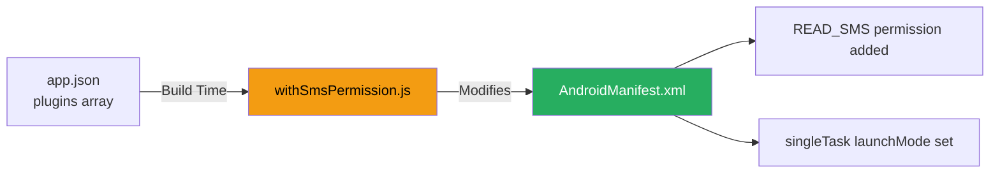
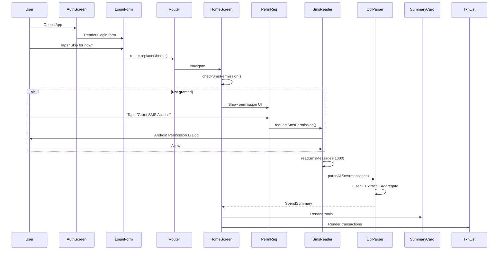

# SyncSpend - Module-Wise Design Document

**Group Number**: 67  
**Supervisor Name**: Preethy  
**Project Title**: SyncSpend — Privacy-First UPI Expense Intelligence  
**Group Members**:
- Aarya Patil (2023EBCS778)
- Prathmesh Bhardwaj (2023EBCS614)

---

## Table of Contents
1. [Module Overview](#module-overview)
2. [Service Modules](#service-modules)
3. [UI Component Modules](#ui-component-modules)
4. [Configuration Modules](#configuration-modules)
5. [Build Plugin Modules](#build-plugin-modules)
6. [Module Interaction Patterns](#module-interaction-patterns)

---

## 1. Module Overview

SyncSpend is organized into **5 primary module groups** across the mobile application:



### Module Summary

| Module Group | Count | Purpose |
|-------------|-------|---------|
| Service Modules | 3 | SMS reading, UPI parsing, type safety |
| Auth UI Components | 6 | Authentication screens with glassmorphism design |
| Dashboard UI Components | 3 | Permission request, spend summary, transaction list |
| Configuration | 2 | Design tokens, app metadata |
| Build Plugins | 1 | Android manifest modifications |

---

## 2. Service Modules

### 2.1 SMS Reader Module (`services/smsReader.ts`)

#### Responsibilities
- Request `READ_SMS` runtime permission on Android
- Check existing permission status
- Read SMS messages from the device inbox via native bridge
- Orchestrate the full pipeline: read → parse → return summary

#### Components



#### Exported Functions

| Function | Parameters | Returns | Description |
|----------|-----------|---------|-------------|
| `requestSmsPermission()` | none | `Promise<boolean>` | Triggers Android runtime permission dialog |
| `checkSmsPermission()` | none | `Promise<boolean>` | Checks if permission already granted |
| `readSmsMessages()` | `maxCount?: number` (default: 500) | `Promise<SmsMessage[]>` | Reads raw SMS from inbox |
| `getUpiTransactions()` | `maxMessages?: number` (default: 500) | `Promise<SpendSummary>` | Full pipeline: read + parse |

#### Platform Handling
- All functions return `false` or `[]` on non-Android platforms
- Native module is dynamically imported to prevent iOS crashes:
```typescript
const SmsModule = require('react-native-get-sms-android');
const SmsAndroid = SmsModule.default || SmsModule;
```

#### Permission Dialog Configuration
```typescript
{
    title: 'SMS Permission',
    message: 'UPI Parser needs access to your SMS messages to read and analyze your UPI transactions.',
    buttonNeutral: 'Ask Me Later',
    buttonNegative: 'Cancel',
    buttonPositive: 'OK',
}
```

---

### 2.2 UPI Parser Module (`services/upiParser.ts`)

#### Responsibilities
- Identify UPI transaction messages from bulk SMS
- Extract transaction amounts using regex patterns
- Classify transactions as debit or credit
- Extract merchant/payee names
- Detect originating bank from sender address
- Extract UPI reference numbers
- Aggregate parsed transactions into a spend summary

#### Components



#### Detection Strategy

**Step 1 — UPI Message Identification** (`isUpiMessage`):

Checks for 20+ keywords in the SMS body:

| Category | Keywords |
|----------|----------|
| UPI-specific | `upi`, `upi ref`, `upi txn`, `upi id` |
| Transfer types | `imps`, `neft`, `debited`, `credited` |
| Action phrases | `sent to`, `received from`, `paid to`, `payment of`, `transferred` |
| Payment apps | `google pay`, `gpay`, `phonepe`, `paytm`, `bhim` |

**Step 2 — Amount Extraction** (`extractAmount`):

Three regex patterns tried in order:

```
Pattern 1: /(?:rs\.?|inr\.?|₹)\s*([\d,]+\.?\d*)/i
  Matches: "Rs.500", "INR 1,000.00", "₹250"

Pattern 2: /(?:amount|amt)[\s:]*(?:rs\.?|inr\.?|₹)?\s*([\d,]+\.?\d*)/i
  Matches: "Amount: Rs 500", "Amt 1000"

Pattern 3: /([\d,]+\.?\d*)\s*(?:debited|credited)/i
  Matches: "500.00 debited"
```

**Step 3 — Type Classification** (`getTransactionType`):

| Type | Indicator Words |
|------|----------------|
| **Debit** | `debited`, `debit`, `sent`, `paid`, `payment`, `transferred`, `withdrawn`, `purchase`, `spent` |
| **Credit** | `credited`, `credit`, `received`, `refund`, `cashback`, `deposit` |

Credit indicators are checked first to handle ambiguous messages. Default to debit if unclear.

**Step 4 — Merchant Extraction** (`extractMerchant`):

Four regex patterns tried:
```
Pattern 1: /(?:to|paid to|sent to|transferred to)\s+([A-Za-z0-9\s@._-]+?)(?:\s+(?:on|via|ref|upi|$))/i
Pattern 2: /(?:from|received from|credited by)\s+([A-Za-z0-9\s@._-]+?)(?:\s+(?:on|via|ref|upi|$))/i
Pattern 3: /(?:at|merchant)\s+([A-Za-z0-9\s@._-]+?)(?:\s+(?:on|via|ref|upi|$))/i
Pattern 4: /VPA\s+([A-Za-z0-9@._-]+)/i
```

**Step 5 — Bank Detection** (`detectBank`):

Maps sender address to bank name:

| Sender Code | Bank Name |
|-------------|-----------|
| `SBIUPI` / `SBIPSG` / `SBIINB` | SBI |
| `HDFCBK` | HDFC |
| `ICICIB` | ICICI |
| `AXISBK` | Axis |
| `KOTAKB` | Kotak |
| `PNBSMS` | PNB |
| `PAYTM` | Paytm |
| `GPAY` | Google Pay |
| `PHONEPE` | PhonePe |

Supports 18 bank codes total.

#### Aggregation Logic (`parseAllSms`)



---

### 2.3 Type Definitions Module (`services/types.ts`)

#### Data Models

```typescript
// Raw SMS message from Android content provider
interface SmsMessage {
    _id: string;         // Unique message ID
    address: string;     // Sender address (e.g., "HDFCBK")
    body: string;        // Full SMS text
    date: number;        // Unix timestamp (ms)
    date_sent: number;   // Sent timestamp
    type: number;        // 1 = inbox, 2 = sent
    read: number;        // 0 = unread, 1 = read
}

// Parsed UPI transaction
interface UpiTransaction {
    id: string;                // Unique ID (from SMS _id or date)
    type: 'debit' | 'credit'; // Transaction direction
    amount: number;            // Transaction amount in INR
    merchant: string;          // Extracted payee/payer name
    date: Date;                // Transaction date
    bank: string;              // Detected bank name
    upiRef: string | null;     // UPI reference number
    rawMessage: string;        // Original SMS text
}

// Aggregated spend summary
interface SpendSummary {
    totalSpent: number;          // Sum of all debits
    totalReceived: number;       // Sum of all credits
    transactionCount: number;    // Total parsed transactions
    debitCount: number;          // Number of debits
    creditCount: number;         // Number of credits
    transactions: UpiTransaction[]; // All parsed transactions
}
```

---

## 3. UI Component Modules

### 3.1 Auth Components (`components/auth/`)

#### AnimatedBackground

| Property | Value |
|----------|-------|
| **File** | `components/auth/AnimatedBackground.tsx` |
| **Purpose** | Full-screen gradient background with animated floating orbs |
| **Props** | `children: React.ReactNode` |
| **Features** | Linear gradient (deep purple → midnight blue), two animated orbs with continuous translation loops |

**Animation Details**:
- Orb 1 (blue): 70% screen width, loops X (6s) and Y (8s) axes
- Orb 2 (pink): 70% screen width, loops X (7s) and Y (5s) axes
- Uses `useNativeDriver: true` for 60fps performance

#### GlassCard

| Property | Value |
|----------|-------|
| **File** | `components/auth/GlassCard.tsx` |
| **Purpose** | Glassmorphism container with blur effect |
| **Props** | `children`, `style?` |
| **Features** | `expo-blur` BlurView (intensity 60), semi-transparent white background, rounded corners (24px), subtle border |

#### GlassInput

| Property | Value |
|----------|-------|
| **File** | `components/auth/GlassInput.tsx` |
| **Purpose** | Styled text input with glass effect and focus animation |
| **Props** | Standard `TextInputProps` + `icon?: ReactNode` |
| **Features** | Focus state changes border color and background, icon slot, consistent height (54px) |

#### GradientButton

| Property | Value |
|----------|-------|
| **File** | `components/auth/GradientButton.tsx` |
| **Purpose** | Animated gradient button with press feedback |
| **Props** | `title`, `onPress?`, `style?` |
| **Features** | Linear gradient (blue → cyan), spring-animated scale on press (0.96), glow shadow effect |

#### LoginForm

| Property | Value |
|----------|-------|
| **File** | `components/auth/LoginForm.tsx` |
| **Purpose** | Login form with email/password inputs and navigation |
| **Props** | `onToggle: () => void` |
| **Features** | Email + Password inputs, "Forgot Password" link, Sign In button (navigates to `/home`), "Skip for now" link, toggle to Sign Up |

#### SignupForm

| Property | Value |
|----------|-------|
| **File** | `components/auth/SignupForm.tsx` |
| **Purpose** | Registration form with validation fields |
| **Props** | `onToggle: () => void` |
| **Features** | Full Name, Email, Password, Confirm Password inputs, Sign Up button, toggle to Sign In |

---

### 3.2 Dashboard Components (`components/dashboard/`)

#### PermissionRequest

| Property | Value |
|----------|-------|
| **File** | `components/dashboard/PermissionRequest.tsx` |
| **Purpose** | Explains why SMS permission is needed and provides grant button |
| **Props** | `onGrant: () => void`, `isLoading?: boolean` |
| **Features** | Shield icon, explanation text, 3 feature bullet points (offline, transactional only, instant insights), gradient "Grant SMS Access" button |

#### SummaryCard

| Property | Value |
|----------|-------|
| **File** | `components/dashboard/SummaryCard.tsx` |
| **Purpose** | Visual summary of total spent vs received |
| **Props** | `summary: SpendSummary` |
| **Features** | Two stat blocks (debits in red, credits in green), transaction count footer, currency formatting in INR (₹) |

#### TransactionList

| Property | Value |
|----------|-------|
| **File** | `components/dashboard/TransactionList.tsx` |
| **Purpose** | Scrollable list of individual parsed transactions |
| **Props** | `transactions: UpiTransaction[]` |
| **Features** | Direction icons (↗ debit, ↙ credit), merchant name, bank + date metadata, color-coded amounts, empty state handling |

---

## 4. Configuration Modules

### 4.1 Theme Constants (`constants/theme.ts`)

Centralized design token system:

| Token Group | Contents |
|-------------|----------|
| **Colors** (22 tokens) | Deep purple, cyber cyan, neon blue, accent pink, glass whites, gradients, orb colors, text hierarchy |
| **Spacing** (6 tokens) | xs (4), sm (8), md (16), lg (24), xl (32), xxl (48) |
| **Radii** (5 tokens) | sm (8), md (12), lg (16), xl (24), full (9999) |
| **FontSizes** (6 tokens) | xs (12), sm (14), md (16), lg (20), xl (28), xxl (34) |

### 4.2 App Configuration (`app.json`)

| Setting | Value |
|---------|-------|
| Name | UPI Parser |
| Slug | upi-parser |
| Scheme | `upiparser` |
| Android Package | `com.anonymous.upiparser` |
| Permissions | `android.permission.READ_SMS` |
| Plugins | `expo-router`, `expo-splash-screen`, `./plugins/withSmsPermission` |
| New Architecture | Enabled |
| Typed Routes | Enabled |
| React Compiler | Enabled |

---

## 5. Build Plugin Modules

### 5.1 SMS Permission Plugin (`plugins/withSmsPermission.js`)

**Type**: Expo Config Plugin (modifies `AndroidManifest.xml` at build time)

#### Responsibilities
1. Add `android.permission.READ_SMS` to the Android manifest
2. Set `android:launchMode="singleTask"` on MainActivity (prevents Expo Router linking conflicts)



---

## 6. Module Interaction Patterns

### 6.1 Complete User Flow



### 6.2 Module Dependency Graph

```mermaid
graph TB
    HomeScreen["app/home.tsx"] --> SmsReader["services/smsReader.ts"]
    HomeScreen --> PermReq["components/dashboard/PermissionRequest.tsx"]
    HomeScreen --> Summary["components/dashboard/SummaryCard.tsx"]
    HomeScreen --> TxnList["components/dashboard/TransactionList.tsx"]
    HomeScreen --> AnimBg["components/auth/AnimatedBackground.tsx"]
    HomeScreen --> GradBtn["components/auth/GradientButton.tsx"]
    HomeScreen --> Theme["constants/theme.ts"]
    HomeScreen --> Types["services/types.ts"]
    
    SmsReader --> Types
    SmsReader --> UpiParser["services/upiParser.ts"]
    SmsReader --> NativeModule["react-native-get-sms-android"]
    UpiParser --> Types
    
    AuthScreen["app/index.tsx"] --> AnimBg
    AuthScreen --> GlassCard["components/auth/GlassCard.tsx"]
    AuthScreen --> LoginForm["components/auth/LoginForm.tsx"]
    AuthScreen --> SignupForm["components/auth/SignupForm.tsx"]
    
    LoginForm --> GlassInput["components/auth/GlassInput.tsx"]
    LoginForm --> GradBtn
    SignupForm --> GlassInput
    SignupForm --> GradBtn
    
    PermReq --> GlassCard
    PermReq --> GradBtn
    Summary --> GlassCard
    TxnList --> GlassCard
    
    style SmsReader fill:#00f0ff,color:black
    style UpiParser fill:#00f0ff,color:black
    style NativeModule fill:#c850c0,color:white
```



---

**Document Version**: 2.0  
**Last Updated**: February 15, 2026  
**Authors**: Aarya Patil, Prathmesh Bhardwaj  
**Project**: SyncSpend — Privacy-First UPI Expense Intelligence
