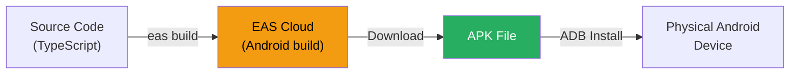

# SyncSpend - Technology Stack Justification

**Group Number**: 67  
**Supervisor Name**: Preethy  
**Project Title**: SyncSpend — Privacy-First UPI Expense Intelligence  
**Group Members**:
- Aarya Patil (2023EBCS778)
- Prathmesh Bhardwaj (2023EBCS614)

---

## Executive Summary

This document provides a detailed justification for the technology choices made for the SyncSpend project. Each technology has been evaluated based on **project requirements**, **team expertise**, **privacy constraints**, **cost-effectiveness**, and **industry best practices**.

---

## Technology Selection Criteria

We evaluated technologies based on:

1. **Privacy Alignment** — No data should leave the user's device
2. **Android Compatibility** — Must access Android SMS content provider
3. **Development Speed** — Rapid prototyping within semester timeline
4. **Cost** — Free for development and distribution
5. **Community Support** — Documentation, ecosystem maturity, and community size
6. **Learning Value** — Academic and career relevance
7. **Team Familiarity** — Existing knowledge base

---

## Technology Stack Overview

| Layer | Technology | Version | License |
|-------|-----------|---------|---------|
| **Mobile Framework** | React Native (Expo) | SDK 54 | MIT |
| **Language** | TypeScript | 5.9 | Apache 2.0 |
| **Routing** | Expo Router | 6.x | MIT |
| **SMS Access** | react-native-get-sms-android | 2.1.0 | MIT |
| **UI Effects** | expo-blur, expo-linear-gradient | 15.x | MIT |
| **Icons** | lucide-react-native | 0.564 | ISC |
| **Animations** | React Native Animated API | Built-in | MIT |
| **Build System** | EAS Build | Cloud | Free Tier |
| **Version Control** | Git + GitHub | - | Free |

---

## 1. Mobile Application Stack

### 1.1 React Native with Expo

**Choice**: React Native via Expo SDK 54  
**Alternatives Considered**: Flutter, Native Kotlin, bare React Native

#### Justification

✅ **Pros**:
- **Expo Dev Client**: Allows native module usage (SMS reader) while retaining hot-reload DX
- **File-based routing**: `expo-router` provides intuitive navigation (`app/index.tsx` → `/`, `app/home.tsx` → `/home`)
- **Config plugins**: Modify `AndroidManifest.xml` without ejecting (used for SMS permission and `singleTask` launch mode)
- **EAS Build**: Cloud-based Android APK compilation — no local Android SDK required on macOS
- **Large ecosystem**: 100,000+ npm packages, 116k+ GitHub stars
- **Industry adoption**: Used by Meta, Microsoft, Shopify, Discord
- **Cross-platform potential**: iOS version possible in future (with alternative data source)

❌ **Cons**:
- Slightly larger APK than native Kotlin (~25MB vs ~10MB)
- Cannot use Expo Go for testing (native SMS module requires dev client build)

#### Why Not Flutter?
| Criteria | React Native (Expo) | Flutter |
|----------|---------------------|---------|
| Language | TypeScript (industry standard) | Dart (less common) |
| SMS Library Support | `react-native-get-sms-android` (mature) | `flutter_sms_inbox` (less maintained) |
| Config Plugins | Expo config plugins | Platform channels (more complex) |
| Team Experience | Strong JS/TS knowledge | Would require Dart learning |
| Ecosystem Size | 2M+ npm packages | Smaller pub.dev ecosystem |

#### Why Not Native Kotlin?
- Would lock us to Android only (no cross-platform potential)
- No hot-reload development experience
- Longer development time for UI components
- Team more proficient in TypeScript

#### Why Not Bare React Native (without Expo)?
- Expo provides config plugins that simplify manifest modifications
- EAS Build eliminates need for local Android SDK setup
- Expo Router provides file-based routing out of the box
- Expo libraries (blur, gradient, splash screen) are well-tested

---

### 1.2 TypeScript

**Choice**: TypeScript 5.9  
**Alternatives Considered**: JavaScript (ES6+)

#### Justification

✅ **Type Safety**: Critical for parsing logic — `SmsMessage`, `UpiTransaction`, and `SpendSummary` interfaces prevent runtime errors  
✅ **Developer Experience**: IntelliSense, auto-completion, refactoring support  
✅ **Documentation**: Types serve as self-documenting code  
✅ **Industry Standard**: 78% of React Native projects use TypeScript  
✅ **Zero Runtime Cost**: Types are stripped at compile time

#### Example of Type Safety Benefit

```typescript
// Without TypeScript: easy to miss a field or use wrong type
const txn = { amount: "500" }; // Bug: string instead of number

// With TypeScript: caught at compile time
interface UpiTransaction {
    amount: number;
    type: 'debit' | 'credit';
}
const txn: UpiTransaction = { amount: 500, type: 'debit' }; // ✓ Safe
```

---

### 1.3 Expo Router

**Choice**: Expo Router 6.x (file-based routing)  
**Alternatives Considered**: React Navigation (manual routing)

#### Justification

✅ **Convention over configuration**: File system maps directly to routes  
✅ **Deep linking**: Automatic with `upiparser` scheme  
✅ **Typed routes**: Compile-time route validation  
✅ **Simple navigation**: `router.replace('/home')` replaces entire stack

#### Route Structure

| File | Route | Screen |
|------|-------|--------|
| `app/index.tsx` | `/` | Auth Screen (Login / Signup) |
| `app/home.tsx` | `/home` | Dashboard (SMS Parser) |
| `app/_layout.tsx` | — | Root layout (StatusBar, Stack config) |

---

### 1.4 react-native-get-sms-android

**Choice**: `react-native-get-sms-android` v2.1.0  
**Alternatives Considered**: SMS Retriever API, Custom native module

#### Justification

✅ **Full inbox access**: Can read all SMS messages (not just OTPs)  
✅ **Filter support**: Filter by box type (inbox), max count  
✅ **JSON output**: Returns parsed JSON array of SMS objects  
✅ **Maintained**: Active community, 200+ GitHub stars  
✅ **Simple API**: Three-line integration with callback pattern

#### Why Not SMS Retriever API?
- Only works for **incoming** messages with a specific hash — designed for OTP auto-fill
- Cannot read historical SMS messages
- Cannot scan the full inbox

#### Why Not Custom Native Module?
- `react-native-get-sms-android` already solves the exact problem
- Writing a custom module would duplicate effort
- Less community testing and maintenance

#### Integration Example

```typescript
SmsAndroid.list(
    JSON.stringify({ box: 'inbox', maxCount: 1000 }),
    (fail: string) => { /* error handling */ },
    (_count: number, smsList: string) => {
        const messages = JSON.parse(smsList);
        // Process messages...
    }
);
```

---

## 2. UI & Design Stack

### 2.1 expo-blur (Glassmorphism)

**Choice**: `expo-blur` for BlurView effects  
**Justification**:
- ✅ Enables glassmorphism design pattern (frosted glass cards)
- ✅ Native blur implementation (performant, not CSS-simulated)
- ✅ Cross-platform (works on iOS, Android, Web)
- ✅ Expo-maintained, stable API

### 2.2 expo-linear-gradient

**Choice**: `expo-linear-gradient` for gradient backgrounds and buttons  
**Justification**:
- ✅ Required for animated background (deep purple → midnight blue)
- ✅ Required for gradient buttons (blue → cyan)
- ✅ Native implementation, hardware-accelerated

### 2.3 lucide-react-native

**Choice**: Lucide icons  
**Alternatives Considered**: `@expo/vector-icons`, `react-native-vector-icons`

**Justification**:
- ✅ Modern, clean icon set (1000+ icons)
- ✅ Tree-shakeable — only imports used icons
- ✅ TypeScript-first API
- ✅ Icons used: `Mail`, `Lock`, `User`, `ShieldCheck`, `TrendingUp`, `TrendingDown`, `BarChart3`, `ArrowUpRight`, `ArrowDownLeft`

### 2.4 React Native Animated API

**Choice**: Built-in `Animated` API  
**Alternatives Considered**: `react-native-reanimated`

**Justification**:
- ✅ Zero additional bundle size (built into React Native)
- ✅ `useNativeDriver: true` enables 60fps animations on UI thread
- ✅ Sufficient for our animations (orb movement, form transitions, button press)
- ✅ Simpler API for straightforward animations

---

## 3. Build & Development Stack

### 3.1 EAS Build (Expo Application Services)

**Choice**: EAS Build for cloud-based Android compilation  
**Alternatives Considered**: Local Android SDK, GitHub Actions CI/CD

#### Justification

✅ **Zero local setup**: No Android Studio or SDK required on macOS  
✅ **Managed signing**: Android Keystore generated and stored securely in cloud  
✅ **Free tier**: Sufficient for development builds  
✅ **Dev client**: Produces installable APK with expo-dev-client for testing

#### Build Process



| Build Profile | Purpose | Output |
|--------------|---------|--------|
| `development` | Testing with dev client | Debug APK |
| `preview` | Internal testing | Release APK (unsigned) |
| `production` | Play Store submission | AAB (signed) |

### 3.2 Git + GitHub

**Choice**: Git with GitHub repository  
**Repository**: `https://github.com/whybepb/UPI-PARSER`  
**Branch Strategy**: `main` (stable) + `pb-works` (development)

#### Justification
✅ **Industry standard**: Used by 90%+ of developers  
✅ **Free**: Unlimited private repositories  
✅ **Collaboration**: Pull requests for code review  
✅ **Learning value**: Essential skill for software engineering careers

---

## 4. Architecture Decisions — No Backend

### Why No Backend Server?

This is a deliberate architectural choice, not an omission:

| Factor | With Backend | Without Backend (Our Choice) |
|--------|-------------|------------------------------|
| **Privacy** | Data transmitted over network | Zero data leaves device ✅ |
| **Cost** | Server hosting required ($7-25/month) | Zero infrastructure cost ✅ |
| **Latency** | Network round-trip delay | Instant on-device processing ✅ |
| **Availability** | Depends on server uptime | Works without internet ✅ |
| **Complexity** | Auth, API, DB, sync logic | Simpler codebase ✅ |
| **Compliance** | Data protection regulations apply | No data collection = no compliance burden ✅ |
| **Multi-device** | Sync across devices | Single-device only ❌ |
| **Data persistence** | Server stores history | Depends on SMS retention ❌ |

**Conclusion**: For a UPI parser that reads sensitive financial SMS, the privacy-first, offline-only approach is the optimal choice for the MVP phase. Backend services can be added in future phases for optional cloud backup.

---

## 5. Cost Analysis

### Development Phase

| Service | Cost | Notes |
|---------|------|-------|
| Development machines | $0 | Personal laptops |
| Expo / EAS Build | $0 | Free tier (30 builds/month) |
| GitHub | $0 | Student account |
| Android test device | $0 | Personal phone |
| **Total** | **$0** | **Zero cost** |

### Post-MVP Deployment

| Service | Cost | Notes |
|---------|------|-------|
| Google Play Console | $25 | One-time fee (if publishing) |
| EAS Build (production) | $0 | Free tier sufficient |
| Backend / Database | $0 | Not required |
| **Total** | **$0 - $25** | **Minimal investment** |

---

## 6. Technology Risk Assessment

| Technology | Risk Level | Mitigation |
|-----------|------------|------------|
| React Native (Expo) | Low | Mature framework, backed by Meta + Expo team |
| TypeScript | Low | Industry standard, strong tooling |
| react-native-get-sms-android | Medium | Well-maintained; fallback: custom native module |
| EAS Build | Low | Alternative: local Android SDK build |
| expo-blur | Low | Expo-maintained, stable API |
| Regex parsing | Medium | Edge cases handled with multiple patterns + fallbacks |

---

## 7. Learning Outcomes

By using this stack, the team has gained experience in:

1. **Mobile development** — React Native with Expo, TypeScript
2. **Native module integration** — Bridging JavaScript with Android native APIs
3. **Build systems** — Config plugins, EAS cloud builds, APK signing
4. **Text processing** — Regex-based information extraction from unstructured text
5. **UI/UX design** — Glassmorphism, micro-animations, accessible design
6. **Permission management** — Android runtime permissions, AndroidManifest.xml
7. **Version control** — Git branching strategy, collaborative development

---

## 8. Final Recommendation

The **React Native (Expo) + TypeScript** stack is the optimal choice for SyncSpend because:

1. ✅ **Meets all requirements**: Privacy-first, offline-only, Android SMS access
2. ✅ **Zero infrastructure cost**: No servers, databases, or hosting needed
3. ✅ **Fast development**: Hot-reload, file-based routing, config plugins
4. ✅ **Industry-relevant**: React Native + TypeScript are highly marketable skills
5. ✅ **Privacy-optimal**: No backend means zero data breach risk
6. ✅ **Extensible**: Backend + cloud sync can be added in future phases
7. ✅ **Team-aligned**: Builds on existing JavaScript/TypeScript knowledge

---

**Document Version**: 2.0  
**Last Updated**: February 15, 2026  
**Authors**: Aarya Patil, Prathmesh Bhardwaj  
**Project**: SyncSpend — Technology Stack Justification
