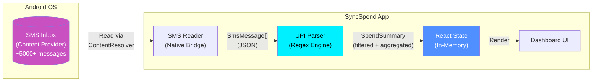
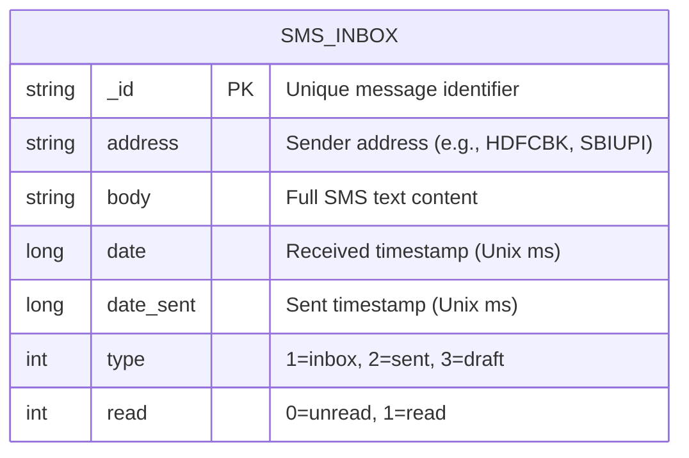
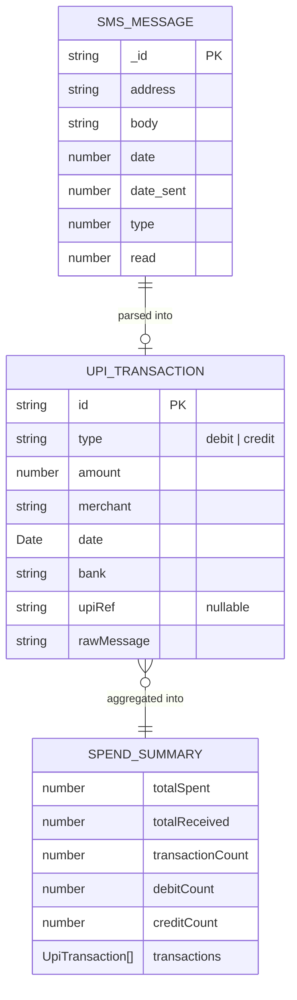
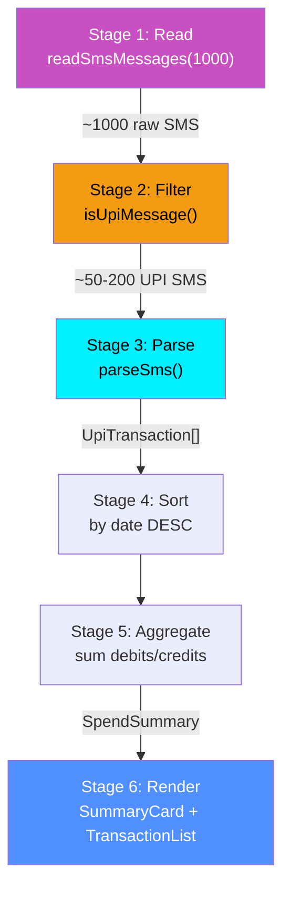
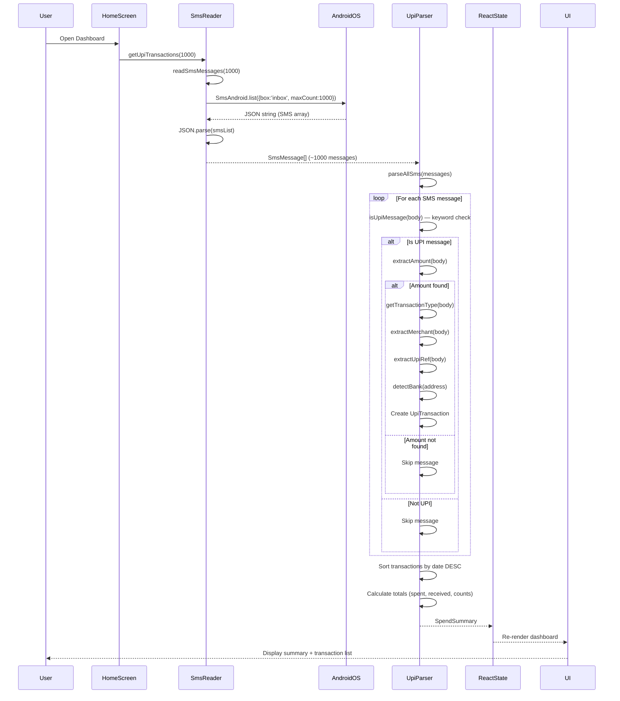
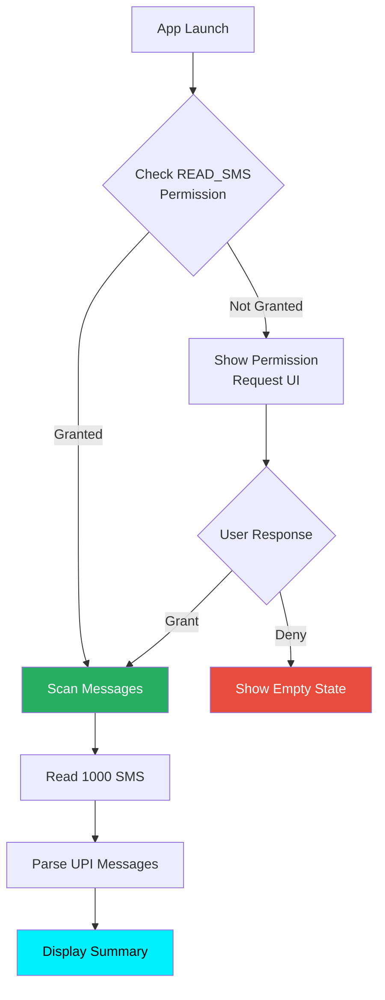
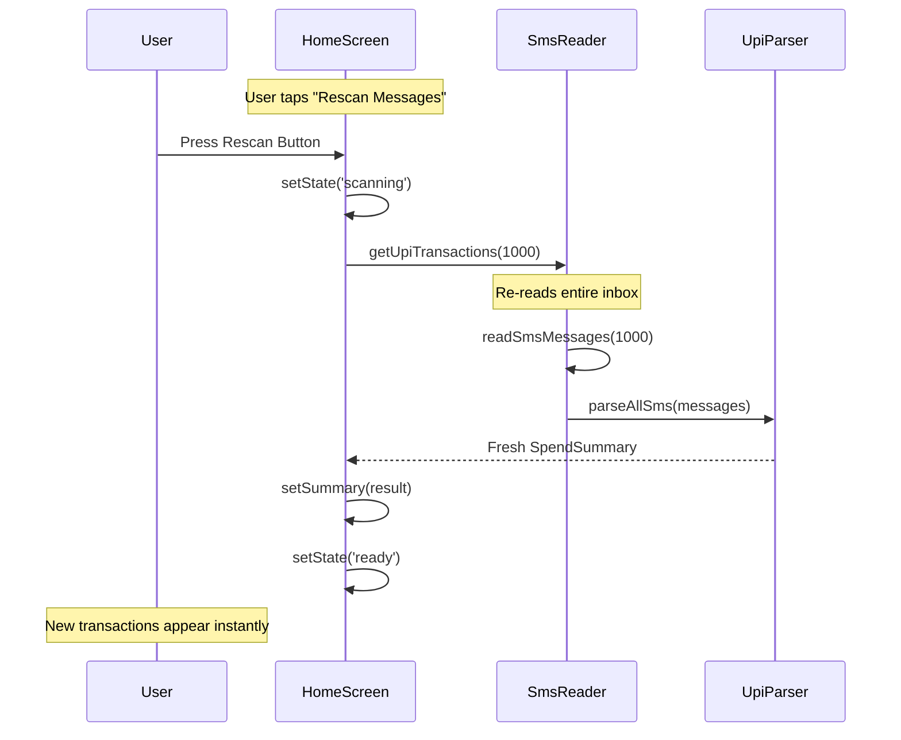
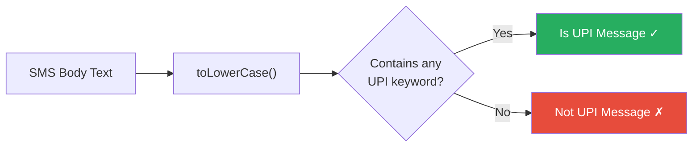
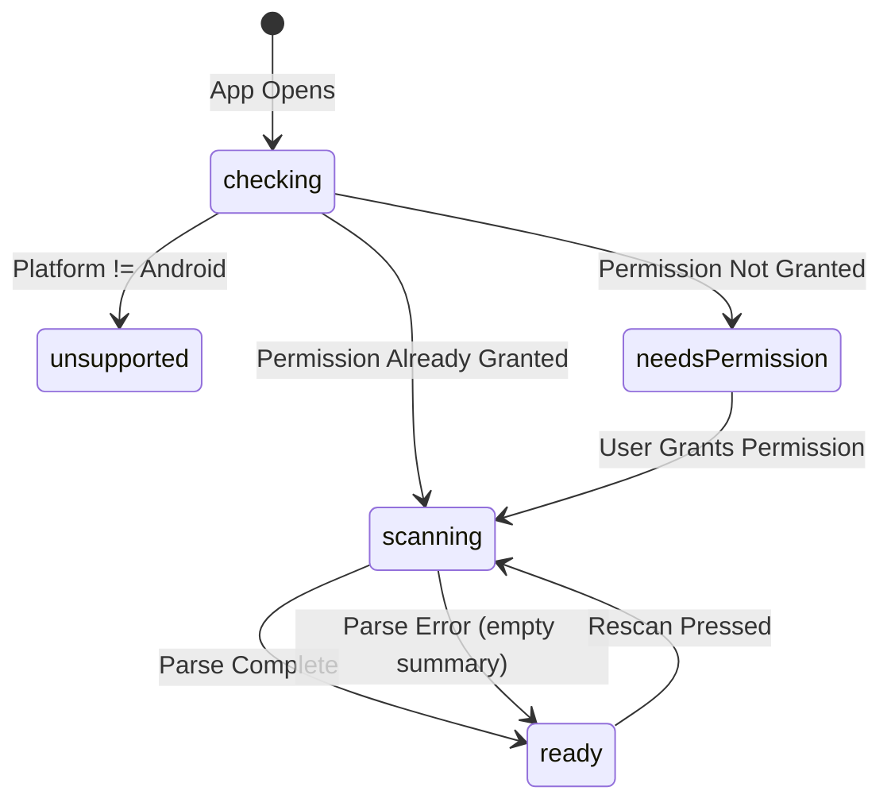
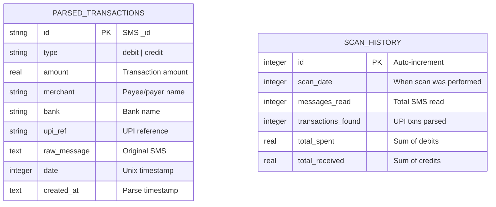

# SyncSpend - Database & Data Flow Design

**Group Number**: 67  
**Supervisor Name**: Preethy  
**Project Title**: SyncSpend — Privacy-First UPI Expense Intelligence  
**Group Members**:
- Aarya Patil (2023EBCS778)
- Prathmesh Bhardwaj (2023EBCS614)

---

## Table of Contents
1. [Data Architecture Overview](#data-architecture-overview)
2. [Data Source: Android SMS Content Provider](#data-source-android-sms-content-provider)
3. [Data Models & Type Definitions](#data-models--type-definitions)
4. [Data Transformation Pipeline](#data-transformation-pipeline)
5. [Data Flow Diagrams](#data-flow-diagrams)
6. [Regex Parsing Engine — Detailed Design](#regex-parsing-engine--detailed-design)
7. [State Management](#state-management)
8. [Data Integrity & Edge Cases](#data-integrity--edge-cases)
9. [Future: Persistent Storage Design](#future-persistent-storage-design)

---

## 1. Data Architecture Overview

SyncSpend uses a **read-only, on-demand data architecture**. Unlike traditional apps with dedicated databases, SyncSpend treats the Android SMS inbox as its sole data source and performs stateless transformations at runtime.



### Design Principles

| Principle | Implementation |
|-----------|---------------|
| **No persistent storage** | Parsed data lives only in React state (memory) |
| **Read-only access** | App never writes, modifies, or deletes any SMS |
| **On-demand processing** | SMS is parsed fresh each time user opens dashboard or rescans |
| **Stateless transforms** | Parser functions are pure — same input always produces same output |
| **Privacy by design** | No data is copied, cached, or transmitted outside the app process |

---

## 2. Data Source: Android SMS Content Provider

### 2.1 Android SMS Schema

The Android OS stores SMS messages in a content provider (`content://sms/inbox`). The `react-native-get-sms-android` library queries this provider and returns results as JSON.



### 2.2 Query Configuration

```typescript
const filter = {
    box: 'inbox',     // Read only inbox messages
    maxCount: 1000,   // Cap at 1000 most recent messages
};

SmsAndroid.list(JSON.stringify(filter), failCallback, successCallback);
```

| Parameter | Value | Rationale |
|-----------|-------|-----------|
| `box` | `'inbox'` | Only incoming messages contain UPI notifications |
| `maxCount` | `1000` | Balance between coverage and parse speed (~2-3s) |

### 2.3 Sample Raw SMS Data

```json
{
    "_id": "12345",
    "address": "HDFCBK",
    "body": "Rs.500.00 debited from A/c **1234 on 15-02-26. UPI Ref: 567890123456. Paid to SWIGGY. Avl Bal: Rs.15,230.50",
    "date": 1739587200000,
    "date_sent": 1739587199000,
    "type": 1,
    "read": 1
}
```

---

## 3. Data Models & Type Definitions

### 3.1 Entity Relationship



### 3.2 Type Definitions (TypeScript)

#### Input: `SmsMessage`
```typescript
interface SmsMessage {
    _id: string;         // Unique SMS ID from Android
    address: string;     // Sender (bank code)
    body: string;        // Full message text
    date: number;        // Unix timestamp (milliseconds)
    date_sent: number;   // Sent timestamp
    type: number;        // 1 = inbox
    read: number;        // 0 = unread, 1 = read
}
```

#### Output: `UpiTransaction`
```typescript
interface UpiTransaction {
    id: string;                // Derived from SMS _id
    type: 'debit' | 'credit'; // Parsed transaction direction
    amount: number;            // Extracted amount (INR)
    merchant: string;          // Extracted payee/payer name
    date: Date;                // Converted from Unix timestamp
    bank: string;              // Mapped from sender address
    upiRef: string | null;     // UPI reference number
    rawMessage: string;        // Original SMS for debugging
}
```

#### Aggregate: `SpendSummary`
```typescript
interface SpendSummary {
    totalSpent: number;             // Sum of all debit amounts
    totalReceived: number;          // Sum of all credit amounts
    transactionCount: number;       // Total parsed transactions
    debitCount: number;             // Number of debit transactions
    creditCount: number;            // Number of credit transactions
    transactions: UpiTransaction[]; // Sorted by date (newest first)
}
```

---

## 4. Data Transformation Pipeline

### 4.1 Pipeline Stages



### 4.2 Data Volume Analysis

| Stage | Input Size | Output Size | Reduction |
|-------|-----------|-------------|-----------|
| **Read (Inbox)** | ~5000 SMS on device | 1000 SMS (maxCount cap) | 80% filtered by recency |
| **Filter (UPI)** | 1000 SMS | ~50-200 UPI messages | 80-95% are non-UPI |
| **Parse** | ~100 UPI messages | ~100 `UpiTransaction` objects | 1:1 (some may fail parsing) |
| **Aggregate** | ~100 transactions | 1 `SpendSummary` | Condensed into single object |

---

## 5. Data Flow Diagrams

### 5.1 Complete Application Data Flow



### 5.2 Permission Flow



### 5.3 Rescan Flow



---

## 6. Regex Parsing Engine — Detailed Design

### 6.1 UPI Message Detection

**Function**: `isUpiMessage(body: string): boolean`

Checks if the SMS body contains any of 20+ UPI-related keywords:



**Keyword Categories**:

| Category | Keywords |
|----------|----------|
| UPI Terms | `upi`, `upi ref`, `upi txn`, `upi id` |
| Transfer Types | `imps`, `neft`, `debited`, `credited` |
| Actions | `sent to`, `received from`, `paid to`, `payment of`, `transferred` |
| Apps | `google pay`, `gpay`, `phonepe`, `paytm`, `bhim` |

### 6.2 Amount Extraction

**Function**: `extractAmount(body: string): number | null`

Three regex patterns tried sequentially:

| Priority | Pattern | Matches |
|----------|---------|---------|
| 1 | `/(?:rs\.?|inr\.?|₹)\s*([\d,]+\.?\d*)/i` | `Rs.500`, `INR 1,000.00`, `₹250` |
| 2 | `/(?:amount|amt)[\s:]*(?:rs\.?|inr\.?|₹)?\s*([\d,]+\.?\d*)/i` | `Amount: Rs 500`, `Amt 1000` |
| 3 | `/([\d,]+\.?\d*)\s*(?:debited|credited)/i` | `500.00 debited` |

**Processing**: Commas are stripped, result parsed as float, validated as positive number.

### 6.3 Transaction Type Classification

**Function**: `getTransactionType(body: string): 'debit' | 'credit'`

| Type | Indicator Words | Priority |
|------|----------------|----------|
| **Credit** (checked first) | `credited`, `credit`, `received`, `refund`, `cashback`, `deposit` | Higher |
| **Debit** | `debited`, `debit`, `sent`, `paid`, `payment`, `transferred`, `withdrawn`, `purchase`, `spent` | Lower |
| **Default** | (if no match) | Defaults to `debit` |

Credit is checked first to handle messages that contain both "debited" and "credited" (e.g., "amount debited from sender and credited to receiver").

### 6.4 Merchant Extraction

**Function**: `extractMerchant(body: string): string`

Four regex patterns tried sequentially:

| Priority | Pattern | Example Match |
|----------|---------|---------------|
| 1 | `/(?:to\|paid to\|sent to\|transferred to)\s+([...]+?)(?:\s+(?:on\|via\|ref\|upi\|$))/i` | "Paid to **SWIGGY** on..." |
| 2 | `/(?:from\|received from\|credited by)\s+([...]+?)(?:...)/i` | "Received from **JOHN** via..." |
| 3 | `/(?:at\|merchant)\s+([...]+?)(?:...)/i` | "at **Amazon** ref..." |
| 4 | `/VPA\s+([A-Za-z0-9@._-]+)/i` | "VPA **merchant@upi**" |

Falls back to `"Unknown"` if no pattern matches. Merchant names are truncated to 40 characters.

### 6.5 Bank Detection

**Function**: `detectBank(address: string): string`

Maps the SMS sender address to a human-readable bank name:

| Sender Codes | Bank Name |
|-------------|-----------|
| `SBIUPI`, `SBIPSG`, `SBIINB` | SBI |
| `HDFCBK` | HDFC |
| `ICICIB` | ICICI |
| `AXISBK` | Axis |
| `KOTAKB` | Kotak |
| `PNBSMS` | PNB |
| `BOIIND` | BOI |
| `CANBNK` | Canara |
| `UNIONB` | Union |
| `IDFCFB` | IDFC |
| `YESBNK` | Yes Bank |
| `INDBNK` | Indian Bank |
| `CENTBK` | Central Bank |
| `PAYTM` | Paytm |
| `GPAY` | Google Pay |
| `PHONEPE` | PhonePe |
| `JioPay` | Jio |

Falls back to first 10 alphabetic characters of sender address.

### 6.6 UPI Reference Extraction

**Function**: `extractUpiRef(body: string): string | null`

```
Pattern: /(?:upi\s*ref[:\s]*|ref\s*no[:\s]*|txn\s*id[:\s]*|ref[:\s]*)(\d{6,})/i
```

Matches 6+ digit reference numbers following common prefix patterns.

---

## 7. State Management

### 7.1 Home Screen State Machine



### 7.2 State Variables

```typescript
// Home Screen State
type ScreenState = 'checking' | 'needsPermission' | 'scanning' | 'ready' | 'unsupported';

const [state, setState] = useState<ScreenState>('checking');
const [summary, setSummary] = useState<SpendSummary | null>(null);
```

| State | UI Shown | Data Available |
|-------|----------|---------------|
| `checking` | Loading spinner | No |
| `unsupported` | "Only available on Android" message | No |
| `needsPermission` | PermissionRequest component | No |
| `scanning` | Loading spinner + "Scanning..." | No |
| `ready` | SummaryCard + TransactionList + Rescan button | Yes |

---

## 8. Data Integrity & Edge Cases

### 8.1 Parse Failure Handling

| Scenario | Handling | Outcome |
|----------|----------|---------|
| SMS body has no UPI keywords | `isUpiMessage()` returns `false` | Message skipped |
| UPI SMS but no extractable amount | `extractAmount()` returns `null` | Message skipped |
| Amount is negative or zero | Validation check fails | Message skipped |
| Merchant name not found | Falls back to `"Unknown"` | Transaction still included |
| UPI ref not found | Set to `null` | Transaction still included |
| Bank not recognized | First 10 chars of sender address used | Transaction still included |
| JSON parse error on SMS list | Catch block returns `[]` | Empty summary displayed |
| Native module undefined | Fallback `SmsModule.default \|\| SmsModule` | Graceful handling |

### 8.2 Data Accuracy Considerations

| Factor | Impact | Mitigation |
|--------|--------|------------|
| Non-standard SMS formats | Some banks use unusual formats | Multiple regex patterns with fallback chain |
| Promotional SMS with amounts | Could be falsely detected as UPI | Keyword gating filters most marketing SMS |
| Multiple amounts in one SMS | Could extract wrong amount | First matching pattern takes priority (currency prefix > keyword > suffix) |
| SMS in regional languages | Not currently supported | English-only parsing in MVP; extensible for regional languages |

---

## 9. Future: Persistent Storage Design

Currently, SyncSpend **does not use any persistent storage** — parsed data exists only in React state and is discarded when the app closes. This section outlines the planned database design for future phases.

### 9.1 Planned SQLite Schema (Phase 2)



### 9.2 Benefits of Future Persistent Storage

| Benefit | Description |
|---------|-------------|
| **Faster reopens** | Cache parsed results instead of re-scanning |
| **Historical trends** | Track spending over months |
| **Category tagging** | Let users categorize transactions |
| **Budget tracking** | Compare spending against user-set budgets |
| **Export** | Allow data export as CSV/PDF |

---

**Document Version**: 2.0  
**Last Updated**: February 15, 2026  
**Authors**: Aarya Patil, Prathmesh Bhardwaj  
**Project**: SyncSpend — Database & Data Flow Design
